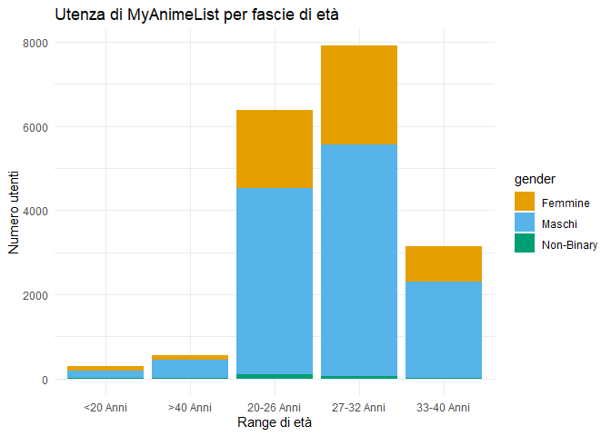
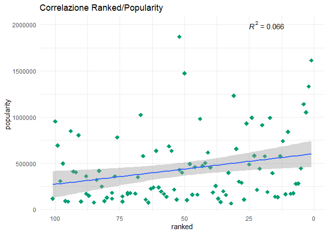

Anime e utenza in numeri
================
Pietro Iudici
2023-02-14

<style type="text/css">
body {
background-color: #FFFEF2
}
</style>

## Un successo globale in continua crescita

Ormai diventati un fenomeno di massa, gli **Anime** (abbreviazione per
Animation) sono la versione giapponese dei cartoni animati occidentali.
Nonostante esistano da decenni (i primi corti risalgono a poco dopo la
seconda guerra mondiale) **negli ultimi 10 anni si è assistito ad un
incremento sia di produzioni che di pubblico**. Grazie anche allo
streaming il pubblico occidentale ha potuto iniziare a fruire legalmente
di questo media Made In Japan senza dovere acquistare costose edizioni
Home Video o ricorrere alla pirateria on-line. Ci sono svariati generi
per tutti i gusti ed età: i più famosi sono i cosiddetti “*Shonen*” (in
giapponese significa giovane oppure ragazzo) e alcuni esempi sono:
Dragon Ball, Naurto e One Piece. Per il pubblico più adulto ci sono i
“*Seinen*” che trattano temi maturi e hanno trame più complesse, come
esempi si possono citare Death Note, Monster e Parasyte. Le opere
apposta per i bambini invece si chiamano “*Kodomo*”.

## Scopo dell’analisi

In questo documento si cercherà di portare alla luce diversi
**insights** sugli Anime più famosi e sull’utenza che ne fruisce.
Principalmente le domande a cui si cercherà una risposta saranno:

- Quali sono gli anime col punteggio degli utenti più alto?
- Quali sono quelli più popolari?
- C’è una correlazione tra le due classifiche e quella generale del
  portale MyAnimeList?
- che tipo di utenza è presente all’interno della community?

## Fonti e contenuto dei Datasets

Verranno Utilizzati **due datasets** generati dal sito
[**MyAnimeList**](https://myanimelist.net/), considerato il portale
occidentale dedicato più completo e affidabile. **I dati sono già stati
puliti e sono pronti per essere importati**, per visualizzarli anche in
versione **raw** cliccare il link
[**qui**](https://docs.google.com/spreadsheets/d/1z_ZdzDfD5cVYXOkaAPXYKMTWRmYneqj3ueimCsgQymA/edit?usp=sharing)
per essere indirizzati ad un file Google Sheets dove sono state
effettuate le medesime analisi e visualizzazioni oltre a contenere regi
un **Log** apposito con tutte le modifiche effettuate ai Datasets
originali.

Il **primo Dataset** contiene tutti gli Anime presenti nel sito assieme
ad informazioni importanti per l’analisi quali il numero di episodi, un
codice identificativo, il genere, il numero di utenti che hanno
interagito nel sito, il voto medio, la posizione in classifica (un
insieme di popolarità e voto medio generata da MyAnimeList) e un link
alla pagina Wikipedia dedicata.

Il **secondo Dataset** è riferito ad un campione di utenti registrati al
forum MyAnimeList e comprende informazioni quali nome e cognome, età,
anime preferiti, fascia di età, genere e link al profilo.

## Inizio analisi

### installazione e caricamento librerie e dati

Per poter analizzare appieno i Datasets vengono utilizzate quattro
librerie: **Tidyverse**, una suite di strumenti appositi per facilitare
i processi di analisi, **ggplot2** e **plotly**, ottime per creare
visualizzazioni in modo semplice e chiaro e **ggpubr**, libreria
utilizzata per mostrare i risultati di formule matematiche.

``` r
install.packages("tidyverse", repos = "http://cran.us.r-project.org")
install.packages("ggplot2", repos = "http://cran.us.r-project.org")
install.packages("plotly")
install.packages("ggpubr")
```

``` r
library(tidyverse)
```

    ## ── Attaching packages ─────────────────────────────────────── tidyverse 1.3.2 ──
    ## ✔ ggplot2 3.4.1     ✔ purrr   1.0.1
    ## ✔ tibble  3.1.8     ✔ dplyr   1.1.0
    ## ✔ tidyr   1.3.0     ✔ stringr 1.5.0
    ## ✔ readr   2.1.4     ✔ forcats 1.0.0
    ## ── Conflicts ────────────────────────────────────────── tidyverse_conflicts() ──
    ## ✖ dplyr::filter() masks stats::filter()
    ## ✖ dplyr::lag()    masks stats::lag()

``` r
library(ggplot2)
library(plotly)
```

    ## 
    ## Caricamento pacchetto: 'plotly'
    ## 
    ## Il seguente oggetto è mascherato da 'package:ggplot2':
    ## 
    ##     last_plot
    ## 
    ## Il seguente oggetto è mascherato da 'package:stats':
    ## 
    ##     filter
    ## 
    ## Il seguente oggetto è mascherato da 'package:graphics':
    ## 
    ##     layout

``` r
library(readxl)
library(ggpubr)
```

### Importazione Datasets

Di seguito viene mostrato il codice per **importare** i Datasets
assegnandoli ad una variabile.

``` r
anime_data <- read_excel("anime_data_clean.xlsx")
profiles_data <- read_excel("profiles_data_clean.xlsx")
```

### Esplorazione Datasets

Ora viene visualizzata un’anteprima dei due Datasets per per avere
un’idea della loro struttura.

``` r
head(anime_data)
```

    ## # A tibble: 6 × 8
    ##     uid ranked title                           genre episo…¹ popul…² score link 
    ##   <dbl>  <dbl> <chr>                           <chr> <chr>     <dbl> <dbl> <chr>
    ## 1  5114      1 Fullmetal Alchemist: Brotherho… Acti… 64.0    1615084  9.23 http…
    ## 2  9253      2 Steins;Gate                     Thri… 24.0    1331710  9.11 http…
    ## 3 11061      3 Hunter x Hunter (2011)          Acti… 148.0   1052761  9.11 http…
    ## 4 32281      4 Kimi no Na wa.                  Roma… 1.0     1139878  9.09 http…
    ## 5 38524      5 Shingeki no Kyojin Season 3 Pa… Acti… 10.0     446370  9.07 http…
    ## 6 28977      6 Gintama°                        Acti… 51.0     281594  9.05 http…
    ## # … with abbreviated variable names ¹​episodes, ²​popularity

``` r
head(profiles_data)
```

    ## # A tibble: 6 × 6
    ##   profile        gender   Age favorites_anime                      link  age_r…¹
    ##   <chr>          <chr>  <dbl> <chr>                                <chr> <chr>  
    ## 1 Kekksi         Male       2 38524, 37991, 1210, 13601, 4181, 93… http… <20 An…
    ## 2 iinikushi      Female     3 9756, 18679, 21603, 15227, 2236, 38… http… <20 An…
    ## 3 Comic_Sans     Female     3 7785, 877, 10721, 1033, 16774, 440,… http… <20 An…
    ## 4 Pariston01ging Male       3 2547, 2048, 1210, 877, 33, 11061     http… <20 An…
    ## 5 RainyRai       Male       3 30, 721, 145, 18679, 232, 227, 6594… http… <20 An…
    ## 6 Royality       Male       3 1689, 10620, 4181, 2167              http… <20 An…
    ## # … with abbreviated variable name ¹​age_range

qui sotto vengono mostrati invece i vari tipi di dati presenti in ogni
colonna (int, string, ecc..)

``` r
glimpse(anime_data)
```

    ## Rows: 14,262
    ## Columns: 8
    ## $ uid        <dbl> 5114, 9253, 11061, 32281, 38524, 28977, 9969, 820, 35180, 2…
    ## $ ranked     <dbl> 1, 2, 3, 4, 5, 6, 7, 8, 9, 10, 11, 12, 13, 14, 15, 16, 17, …
    ## $ title      <chr> "Fullmetal Alchemist: Brotherhood", "Steins;Gate", "Hunter …
    ## $ genre      <chr> "Action, Military, Adventure, Comedy, Drama, Magic, Fantasy…
    ## $ episodes   <chr> "64.0", "24.0", "148.0", "1.0", "10.0", "51.0", "51.0", "11…
    ## $ popularity <dbl> 1615084, 1331710, 1052761, 1139878, 446370, 281594, 278110,…
    ## $ score      <dbl> 9.23, 9.11, 9.11, 9.09, 9.07, 9.05, 9.04, 9.03, 9.02, 9.01,…
    ## $ link       <chr> "https://myanimelist.net/anime/5114/Fullmetal_Alchemist__Br…

``` r
glimpse(profiles_data)
```

    ## Rows: 18,253
    ## Columns: 6
    ## $ profile         <chr> "Kekksi", "iinikushi", "Comic_Sans", "Pariston01ging",…
    ## $ gender          <chr> "Male", "Female", "Female", "Male", "Male", "Male", "M…
    ## $ Age             <dbl> 2, 3, 3, 3, 3, 3, 3, 3, 3, 3, 3, 3, 4, 4, 4, 4, 4, 4, …
    ## $ favorites_anime <chr> "38524, 37991, 1210, 13601, 4181, 934, 31240, 9253, 32…
    ## $ link            <chr> "https://myanimelist.net/profile/Kekksi", "https://mya…
    ## $ age_range       <chr> "<20 Anni", "<20 Anni", "<20 Anni", "<20 Anni", "<20 A…

infine qui si vedono solamente i nomi delle colonne.

``` r
colnames(anime_data)
```

    ## [1] "uid"        "ranked"     "title"      "genre"      "episodes"  
    ## [6] "popularity" "score"      "link"

``` r
colnames(profiles_data)
```

    ## [1] "profile"         "gender"          "Age"             "favorites_anime"
    ## [5] "link"            "age_range"

### Profile Dataset: Insights sull’utenza

I primi grafici si concentrano sul **genere** e l’**età** del campione
di utenza nel Dataset *Profile Data*.

Il seguente **grafico a torta** mostra le percentuali dei generi.

``` r
t <- list(
  family = "serif",
  size = 18,
  color = "black")

cbPalette <- c("#E69F00", "#56B4E9", "#009E73", "#F0E442", "#CC79A7") # palette apposita per daltonici #
p <-plot_ly(profiles_data, labels = ~gender, type = "pie",  marker = list(colors = cbPalette))
p <- p %>% layout(title = list(text = 'Utenza di MyAnimeList per genere',
         font = t, plot_bgcolor = "#e5ecf6",
         y = 0.99, bold = TRUE, x = 0.28,
         xanchor = 'center', yanchor =  'top'),
         xaxis = list(showgrid = FALSE, zeroline = FALSE, showticklabels = FALSE, 
                      autosize = TRUE, automargin = TRUE),
         yaxis = list(showgrid = FALSE, zeroline = FALSE, showticklabels = FALSE, 
                      autosize = TRUE, automargin = TRUE))
p
```

<div class="plotly html-widget html-fill-item-overflow-hidden html-fill-item" id="htmlwidget-36380ee18e0bce7a3f96" style="width:672px;height:480px;"></div>
<script type="application/json" data-for="htmlwidget-36380ee18e0bce7a3f96">{"x":{"visdat":{"3830383032ce":["function () ","plotlyVisDat"]},"cur_data":"3830383032ce","attrs":{"3830383032ce":{"labels":{},"marker":{"colors":["#E69F00","#56B4E9","#009E73","#F0E442","#CC79A7"]},"alpha_stroke":1,"sizes":[10,100],"spans":[1,20],"type":"pie"}},"layout":{"margin":{"b":40,"l":60,"t":25,"r":10},"title":{"text":"Utenza di MyAnimeList per genere","font":{"family":"serif","size":18,"color":"black"},"plot_bgcolor":"#e5ecf6","y":0.99,"bold":true,"x":0.28,"xanchor":"center","yanchor":"top"},"xaxis":{"showgrid":false,"zeroline":false,"showticklabels":false,"autosize":true,"automargin":true},"yaxis":{"showgrid":false,"zeroline":false,"showticklabels":false,"autosize":true,"automargin":true},"hovermode":"closest","showlegend":true},"source":"A","config":{"modeBarButtonsToAdd":["hoverclosest","hovercompare"],"showSendToCloud":false},"data":[{"labels":["Male","Female","Female","Male","Male","Male","Male","Male","Male","Male","Male","Male","Female","Female","Female","Female","Male","Male","Non-Binary","Non-Binary","Non-Binary","Female","Female","Female","Male","Male","Male","Male","Male","Male","Male","Non-Binary","Non-Binary","Female","Female","Female","Female","Male","Male","Male","Female","Female","Female","Female","Female","Male","Male","Male","Male","Female","Female","Male","Male","Male","Male","Female","Female","Female","Female","Female","Male","Male","Male","Female","Female","Male","Male","Male","Male","Male","Male","Male","Female","Female","Female","Male","Male","Male","Male","Male","Male","Male","Female","Male","Male","Female","Female","Male","Male","Male","Female","Male","Male","Male","Male","Male","Female","Female","Female","Male","Male","Female","Female","Female","Male","Male","Male","Female","Female","Female","Female","Female","Female","Female","Female","Female","Male","Male","Male","Male","Male","Male","Male","Female","Female","Female","Female","Female","Female","Female","Female","Female","Female","Female","Female","Female","Female","Female","Female","Female","Male","Male","Male","Male","Male","Male","Male","Male","Male","Male","Male","Male","Male","Male","Male","Male","Male","Male","Male","Male","Male","Male","Male","Male","Male","Male","Male","Male","Male","Male","Male","Male","Non-Binary","Non-Binary","Female","Female","Female","Female","Female","Female","Female","Female","Female","Female","Female","Female","Female","Female","Female","Female","Female","Female","Female","Female","Female","Female","Female","Female","Female","Female","Female","Female","Female","Female","Female","Female","Female","Female","Female","Female","Male","Male","Male","Male","Male","Male","Male","Male","Male","Male","Male","Male","Male","Male","Male","Male","Male","Male","Male","Male","Male","Male","Male","Male","Male","Male","Male","Male","Male","Male","Male","Male","Male","Male","Male","Male","Male","Male","Male","Male","Male","Male","Male","Male","Male","Male","Male","Male","Male","Male","Male","Male","Male","Male","Male","Male","Male","Male","Male","Male","Male","Male","Male","Male","Male","Male","Male","Male","Male","Male","Male","Male","Male","Male","Male","Male","Male","Male","Non-Binary","Female","Female","Female","Female","Female","Female","Female","Female","Female","Female","Female","Female","Female","Female","Female","Female","Female","Female","Female","Female","Female","Female","Female","Female","Female","Female","Female","Female","Female","Female","Female","Female","Female","Female","Female","Female","Female","Female","Female","Female","Female","Female","Female","Female","Female","Female","Female","Female","Female","Female","Female","Female","Female","Female","Female","Female","Female","Female","Female","Female","Female","Female","Female","Female","Male","Male","Male","Male","Male","Male","Male","Male","Male","Male","Male","Male","Male","Male","Male","Male","Male","Male","Male","Male","Male","Male","Male","Male","Male","Male","Male","Male","Male","Male","Male","Male","Male","Male","Male","Male","Male","Male","Male","Male","Male","Male","Male","Male","Male","Male","Male","Male","Male","Male","Male","Male","Male","Male","Male","Male","Male","Male","Male","Male","Male","Male","Male","Male","Male","Male","Male","Male","Male","Male","Male","Male","Male","Male","Male","Male","Male","Male","Male","Male","Male","Male","Male","Male","Male","Male","Male","Male","Male","Male","Male","Male","Male","Male","Male","Male","Male","Male","Male","Male","Male","Male","Male","Male","Male","Male","Male","Male","Male","Male","Male","Male","Male","Male","Male","Male","Male","Male","Male","Male","Male","Male","Male","Male","Male","Male","Male","Male","Male","Male","Male","Male","Male","Male","Male","Male","Male","Male","Male","Male","Male","Male","Male","Male","Male","Male","Non-Binary","Non-Binary","Non-Binary","Non-Binary","Non-Binary","Non-Binary","Female","Female","Female","Female","Female","Female","Female","Female","Female","Female","Female","Female","Female","Female","Female","Female","Female","Female","Female","Female","Female","Female","Female","Female","Female","Female","Female","Female","Female","Female","Female","Female","Female","Female","Female","Female","Female","Female","Female","Female","Female","Female","Female","Female","Female","Female","Female","Female","Female","Female","Female","Female","Female","Female","Female","Female","Female","Female","Female","Female","Female","Female","Female","Female","Female","Female","Female","Female","Female","Female","Female","Female","Female","Female","Female","Female","Female","Female","Female","Female","Female","Female","Female","Female","Female","Female","Female","Female","Female","Female","Female","Female","Female","Female","Female","Female","Female","Female","Female","Female","Female","Female","Female","Female","Female","Female","Female","Female","Female","Female","Female","Female","Female","Female","Female","Female","Female","Female","Female","Female","Female","Female","Female","Female","Female","Female","Female","Female","Female","Female","Female","Female","Female","Female","Female","Female","Female","Female","Female","Male","Male","Male","Male","Male","Male","Male","Male","Male","Male","Male","Male","Male","Male","Male","Male","Male","Male","Male","Male","Male","Male","Male","Male","Male","Male","Male","Male","Male","Male","Male","Male","Male","Male","Male","Male","Male","Male","Male","Male","Male","Male","Male","Male","Male","Male","Male","Male","Male","Male","Male","Male","Male","Male","Male","Male","Male","Male","Male","Male","Male","Male","Male","Male","Male","Male","Male","Male","Male","Male","Male","Male","Male","Male","Male","Male","Male","Male","Male","Male","Male","Male","Male","Male","Male","Male","Male","Male","Male","Male","Male","Male","Male","Male","Male","Male","Male","Male","Male","Male","Male","Male","Male","Male","Male","Male","Male","Male","Male","Male","Male","Male","Male","Male","Male","Male","Male","Male","Male","Male","Male","Male","Male","Male","Male","Male","Male","Male","Male","Male","Male","Male","Male","Male","Male","Male","Male","Male","Male","Male","Male","Male","Male","Male","Male","Male","Male","Male","Male","Male","Male","Male","Male","Male","Male","Male","Male","Male","Male","Male","Male","Male","Male","Male","Male","Male","Male","Male","Male","Male","Male","Male","Male","Male","Male","Male","Male","Male","Male","Male","Male","Male","Male","Male","Male","Male","Male","Male","Male","Male","Male","Male","Male","Male","Male","Male","Male","Male","Male","Male","Male","Male","Male","Male","Male","Male","Male","Male","Male","Male","Male","Male","Male","Male","Male","Male","Male","Male","Male","Male","Male","Male","Male","Male","Male","Male","Male","Male","Male","Male","Male","Male","Male","Male","Male","Male","Male","Male","Male","Male","Male","Male","Male","Male","Male","Male","Male","Male","Male","Male","Male","Male","Male","Male","Male","Male","Male","Male","Male","Male","Male","Male","Male","Male","Male","Male","Male","Male","Male","Male","Male","Male","Male","Male","Male","Male","Non-Binary","Non-Binary","Non-Binary","Non-Binary","Non-Binary","Non-Binary","Non-Binary","Non-Binary","Non-Binary","Non-Binary","Non-Binary","Female","Female","Female","Female","Female","Female","Female","Female","Female","Female","Female","Female","Female","Female","Female","Female","Female","Female","Female","Female","Female","Female","Female","Female","Female","Female","Female","Female","Female","Female","Female","Female","Female","Female","Female","Female","Female","Female","Female","Female","Female","Female","Female","Female","Female","Female","Female","Female","Female","Female","Female","Female","Female","Female","Female","Female","Female","Female","Female","Female","Female","Female","Female","Female","Female","Female","Female","Female","Female","Female","Female","Female","Female","Female","Female","Female","Female","Female","Female","Female","Female","Female","Female","Female","Female","Female","Female","Female","Female","Female","Female","Female","Female","Female","Female","Female","Female","Female","Female","Female","Female","Female","Female","Female","Female","Female","Female","Female","Female","Female","Female","Female","Female","Female","Female","Female","Female","Female","Female","Female","Female","Female","Female","Female","Female","Female","Female","Female","Female","Female","Female","Female","Female","Female","Female","Female","Female","Female","Female","Female","Female","Female","Female","Female","Female","Female","Female","Female","Female","Female","Female","Female","Female","Female","Female","Female","Female","Female","Female","Female","Female","Female","Female","Female","Female","Female","Female","Female","Female","Female","Female","Female","Female","Female","Female","Female","Female","Female","Male","Male","Male","Male","Male","Male","Male","Male","Male","Male","Male","Male","Male","Male","Male","Male","Male","Male","Male","Male","Male","Male","Male","Male","Male","Male","Male","Male","Male","Male","Male","Male","Male","Male","Male","Male","Male","Male","Male","Male","Male","Male","Male","Male","Male","Male","Male","Male","Male","Male","Male","Male","Male","Male","Male","Male","Male","Male","Male","Male","Male","Male","Male","Male","Male","Male","Male","Male","Male","Male","Male","Male","Male","Male","Male","Male","Male","Male","Male","Male","Male","Male","Male","Male","Male","Male","Male","Male","Male","Male","Male","Male","Male","Male","Male","Male","Male","Male","Male","Male","Male","Male","Male","Male","Male","Male","Male","Male","Male","Male","Male","Male","Male","Male","Male","Male","Male","Male","Male","Male","Male","Male","Male","Male","Male","Male","Male","Male","Male","Male","Male","Male","Male","Male","Male","Male","Male","Male","Male","Male","Male","Male","Male","Male","Male","Male","Male","Male","Male","Male","Male","Male","Male","Male","Male","Male","Male","Male","Male","Male","Male","Male","Male","Male","Male","Male","Male","Male","Male","Male","Male","Male","Male","Male","Male","Male","Male","Male","Male","Male","Male","Male","Male","Male","Male","Male","Male","Male","Male","Male","Male","Male","Male","Male","Male","Male","Male","Male","Male","Male","Male","Male","Male","Male","Male","Male","Male","Male","Male","Male","Male","Male","Male","Male","Male","Male","Male","Male","Male","Male","Male","Male","Male","Male","Male","Male","Male","Male","Male","Male","Male","Male","Male","Male","Male","Male","Male","Male","Male","Male","Male","Male","Male","Male","Male","Male","Male","Male","Male","Male","Male","Male","Male","Male","Male","Male","Male","Male","Male","Male","Male","Male","Male","Male","Male","Male","Male","Male","Male","Male","Male","Male","Male","Male","Male","Male","Male","Male","Male","Male","Male","Male","Male","Male","Male","Male","Male","Male","Male","Male","Male","Male","Male","Male","Male","Male","Male","Male","Male","Male","Male","Male","Male","Male","Male","Male","Male","Male","Male","Male","Male","Male","Male","Male","Male","Male","Male","Male","Male","Male","Male","Male","Male","Male","Male","Male","Male","Male","Male","Male","Male","Male","Male","Male","Male","Male","Male","Male","Male","Male","Male","Male","Male","Male","Male","Male","Male","Male","Male","Male","Male","Male","Male","Male","Male","Male","Male","Male","Male","Male","Male","Male","Male","Male","Male","Male","Male","Male","Male","Male","Male","Male","Male","Male","Male","Male","Male","Male","Male","Male","Male","Male","Male","Male","Male","Male","Male","Male","Male","Male","Male","Male","Male","Male","Male","Male","Male","Male","Male","Male","Male","Male","Male","Male","Male","Male","Male","Male","Male","Male","Male","Male","Male","Male","Male","Male","Male","Male","Male","Male","Male","Male","Male","Male","Non-Binary","Non-Binary","Non-Binary","Non-Binary","Non-Binary","Non-Binary","Non-Binary","Non-Binary","Non-Binary","Non-Binary","Non-Binary","Non-Binary","Non-Binary","Non-Binary","Non-Binary","Female","Female","Female","Female","Female","Female","Female","Female","Female","Female","Female","Female","Female","Female","Female","Female","Female","Female","Female","Female","Female","Female","Female","Female","Female","Female","Female","Female","Female","Female","Female","Female","Female","Female","Female","Female","Female","Female","Female","Female","Female","Female","Female","Female","Female","Female","Female","Female","Female","Female","Female","Female","Female","Female","Female","Female","Female","Female","Female","Female","Female","Female","Female","Female","Female","Female","Female","Female","Female","Female","Female","Female","Female","Female","Female","Female","Female","Female","Female","Female","Female","Female","Female","Female","Female","Female","Female","Female","Female","Female","Female","Female","Female","Female","Female","Female","Female","Female","Female","Female","Female","Female","Female","Female","Female","Female","Female","Female","Female","Female","Female","Female","Female","Female","Female","Female","Female","Female","Female","Female","Female","Female","Female","Female","Female","Female","Female","Female","Female","Female","Female","Female","Female","Female","Female","Female","Female","Female","Female","Female","Female","Female","Female","Female","Female","Female","Female","Female","Female","Female","Female","Female","Female","Female","Female","Female","Female","Female","Female","Female","Female","Female","Female","Female","Female","Female","Female","Female","Female","Female","Female","Female","Female","Female","Female","Female","Female","Female","Female","Female","Female","Female","Female","Female","Female","Female","Female","Female","Female","Female","Female","Female","Female","Female","Female","Female","Female","Female","Female","Female","Female","Female","Female","Female","Female","Female","Female","Female","Female","Female","Female","Female","Female","Female","Female","Female","Female","Female","Female","Female","Female","Female","Female","Female","Female","Female","Female","Female","Female","Female","Female","Female","Female","Female","Female","Female","Female","Female","Female","Female","Female","Female","Female","Female","Female","Female","Female","Female","Female","Female","Female","Female","Female","Female","Female","Female","Female","Female","Female","Female","Female","Female","Female","Female","Female","Female","Female","Female","Female","Female","Female","Female","Female","Female","Female","Female","Female","Female","Female","Female","Female","Female","Female","Male","Male","Male","Male","Male","Male","Male","Male","Male","Male","Male","Male","Male","Male","Male","Male","Male","Male","Male","Male","Male","Male","Male","Male","Male","Male","Male","Male","Male","Male","Male","Male","Male","Male","Male","Male","Male","Male","Male","Male","Male","Male","Male","Male","Male","Male","Male","Male","Male","Male","Male","Male","Male","Male","Male","Male","Male","Male","Male","Male","Male","Male","Male","Male","Male","Male","Male","Male","Male","Male","Male","Male","Male","Male","Male","Male","Male","Male","Male","Male","Male","Male","Male","Male","Male","Male","Male","Male","Male","Male","Male","Male","Male","Male","Male","Male","Male","Male","Male","Male","Male","Male","Male","Male","Male","Male","Male","Male","Male","Male","Male","Male","Male","Male","Male","Male","Male","Male","Male","Male","Male","Male","Male","Male","Male","Male","Male","Male","Male","Male","Male","Male","Male","Male","Male","Male","Male","Male","Male","Male","Male","Male","Male","Male","Male","Male","Male","Male","Male","Male","Male","Male","Male","Male","Male","Male","Male","Male","Male","Male","Male","Male","Male","Male","Male","Male","Male","Male","Male","Male","Male","Male","Male","Male","Male","Male","Male","Male","Male","Male","Male","Male","Male","Male","Male","Male","Male","Male","Male","Male","Male","Male","Male","Male","Male","Male","Male","Male","Male","Male","Male","Male","Male","Male","Male","Male","Male","Male","Male","Male","Male","Male","Male","Male","Male","Male","Male","Male","Male","Male","Male","Male","Male","Male","Male","Male","Male","Male","Male","Male","Male","Male","Male","Male","Male","Male","Male","Male","Male","Male","Male","Male","Male","Male","Male","Male","Male","Male","Male","Male","Male","Male","Male","Male","Male","Male","Male","Male","Male","Male","Male","Male","Male","Male","Male","Male","Male","Male","Male","Male","Male","Male","Male","Male","Male","Male","Male","Male","Male","Male","Male","Male","Male","Male","Male","Male","Male","Male","Male","Male","Male","Male","Male","Male","Male","Male","Male","Male","Male","Male","Male","Male","Male","Male","Male","Male","Male","Male","Male","Male","Male","Male","Male","Male","Male","Male","Male","Male","Male","Male","Male","Male","Male","Male","Male","Male","Male","Male","Male","Male","Male","Male","Male","Male","Male","Male","Male","Male","Male","Male","Male","Male","Male","Male","Male","Male","Male","Male","Male","Male","Male","Male","Male","Male","Male","Male","Male","Male","Male","Male","Male","Male","Male","Male","Male","Male","Male","Male","Male","Male","Male","Male","Male","Male","Male","Male","Male","Male","Male","Male","Male","Male","Male","Male","Male","Male","Male","Male","Male","Male","Male","Male","Male","Male","Male","Male","Male","Male","Male","Male","Male","Male","Male","Male","Male","Male","Male","Male","Male","Male","Male","Male","Male","Male","Male","Male","Male","Male","Male","Male","Male","Male","Male","Male","Male","Male","Male","Male","Male","Male","Male","Male","Male","Male","Male","Male","Male","Male","Male","Male","Male","Male","Male","Male","Male","Male","Male","Male","Male","Male","Male","Male","Male","Male","Male","Male","Male","Male","Male","Male","Male","Male","Male","Male","Male","Male","Male","Male","Male","Male","Male","Male","Male","Male","Male","Male","Male","Male","Male","Male","Male","Male","Male","Male","Male","Male","Male","Male","Male","Male","Male","Male","Male","Male","Male","Male","Male","Male","Male","Male","Male","Male","Male","Male","Male","Male","Male","Male","Male","Male","Male","Male","Male","Male","Male","Male","Male","Male","Male","Male","Male","Male","Male","Male","Male","Male","Male","Male","Male","Male","Male","Male","Male","Male","Male","Male","Male","Male","Male","Male","Male","Male","Male","Male","Male","Male","Male","Male","Male","Male","Male","Male","Male","Male","Male","Male","Male","Male","Male","Male","Male","Male","Male","Male","Male","Male","Male","Male","Male","Male","Male","Male","Male","Male","Male","Male","Male","Male","Male","Male","Male","Male","Male","Male","Male","Male","Male","Male","Male","Male","Male","Male","Male","Male","Male","Male","Male","Male","Male","Male","Male","Male","Male","Male","Male","Male","Male","Male","Male","Male","Male","Male","Male","Male","Male","Male","Male","Male","Male","Male","Male","Male","Male","Male","Male","Male","Male","Male","Male","Male","Male","Male","Male","Male","Male","Male","Male","Male","Male","Male","Male","Male","Male","Male","Male","Male","Male","Male","Male","Male","Male","Male","Male","Male","Male","Male","Male","Male","Male","Male","Male","Male","Male","Male","Male","Male","Male","Male","Male","Male","Male","Male","Male","Male","Male","Male","Male","Male","Non-Binary","Non-Binary","Non-Binary","Non-Binary","Non-Binary","Non-Binary","Non-Binary","Non-Binary","Non-Binary","Non-Binary","Non-Binary","Female","Female","Female","Female","Female","Female","Female","Female","Female","Female","Female","Female","Female","Female","Female","Female","Female","Female","Female","Female","Female","Female","Female","Female","Female","Female","Female","Female","Female","Female","Female","Female","Female","Female","Female","Female","Female","Female","Female","Female","Female","Female","Female","Female","Female","Female","Female","Female","Female","Female","Female","Female","Female","Female","Female","Female","Female","Female","Female","Female","Female","Female","Female","Female","Female","Female","Female","Female","Female","Female","Female","Female","Female","Female","Female","Female","Female","Female","Female","Female","Female","Female","Female","Female","Female","Female","Female","Female","Female","Female","Female","Female","Female","Female","Female","Female","Female","Female","Female","Female","Female","Female","Female","Female","Female","Female","Female","Female","Female","Female","Female","Female","Female","Female","Female","Female","Female","Female","Female","Female","Female","Female","Female","Female","Female","Female","Female","Female","Female","Female","Female","Female","Female","Female","Female","Female","Female","Female","Female","Female","Female","Female","Female","Female","Female","Female","Female","Female","Female","Female","Female","Female","Female","Female","Female","Female","Female","Female","Female","Female","Female","Female","Female","Female","Female","Female","Female","Female","Female","Female","Female","Female","Female","Female","Female","Female","Female","Female","Female","Female","Female","Female","Female","Female","Female","Female","Female","Female","Female","Female","Female","Female","Female","Female","Female","Female","Female","Female","Female","Female","Female","Female","Female","Female","Female","Female","Female","Female","Female","Female","Female","Female","Female","Female","Female","Female","Female","Female","Female","Female","Female","Female","Female","Female","Female","Female","Female","Female","Female","Female","Female","Female","Female","Female","Female","Female","Female","Female","Female","Female","Female","Female","Female","Female","Female","Female","Female","Female","Female","Female","Female","Female","Female","Female","Female","Female","Female","Female","Female","Female","Female","Female","Female","Female","Female","Female","Female","Female","Female","Female","Female","Female","Female","Female","Female","Female","Female","Female","Female","Female","Female","Female","Female","Female","Female","Female","Female","Female","Female","Female","Female","Female","Female","Female","Female","Female","Female","Female","Female","Female","Female","Female","Female","Female","Female","Female","Male","Male","Male","Male","Male","Male","Male","Male","Male","Male","Male","Male","Male","Male","Male","Male","Male","Male","Male","Male","Male","Male","Male","Male","Male","Male","Male","Male","Male","Male","Male","Male","Male","Male","Male","Male","Male","Male","Male","Male","Male","Male","Male","Male","Male","Male","Male","Male","Male","Male","Male","Male","Male","Male","Male","Male","Male","Male","Male","Male","Male","Male","Male","Male","Male","Male","Male","Male","Male","Male","Male","Male","Male","Male","Male","Male","Male","Male","Male","Male","Male","Male","Male","Male","Male","Male","Male","Male","Male","Male","Male","Male","Male","Male","Male","Male","Male","Male","Male","Male","Male","Male","Male","Male","Male","Male","Male","Male","Male","Male","Male","Male","Male","Male","Male","Male","Male","Male","Male","Male","Male","Male","Male","Male","Male","Male","Male","Male","Male","Male","Male","Male","Male","Male","Male","Male","Male","Male","Male","Male","Male","Male","Male","Male","Male","Male","Male","Male","Male","Male","Male","Male","Male","Male","Male","Male","Male","Male","Male","Male","Male","Male","Male","Male","Male","Male","Male","Male","Male","Male","Male","Male","Male","Male","Male","Male","Male","Male","Male","Male","Male","Male","Male","Male","Male","Male","Male","Male","Male","Male","Male","Male","Male","Male","Male","Male","Male","Male","Male","Male","Male","Male","Male","Male","Male","Male","Male","Male","Male","Male","Male","Male","Male","Male","Male","Male","Male","Male","Male","Male","Male","Male","Male","Male","Male","Male","Male","Male","Male","Male","Male","Male","Male","Male","Male","Male","Male","Male","Male","Male","Male","Male","Male","Male","Male","Male","Male","Male","Male","Male","Male","Male","Male","Male","Male","Male","Male","Male","Male","Male","Male","Male","Male","Male","Male","Male","Male","Male","Male","Male","Male","Male","Male","Male","Male","Male","Male","Male","Male","Male","Male","Male","Male","Male","Male","Male","Male","Male","Male","Male","Male","Male","Male","Male","Male","Male","Male","Male","Male","Male","Male","Male","Male","Male","Male","Male","Male","Male","Male","Male","Male","Male","Male","Male","Male","Male","Male","Male","Male","Male","Male","Male","Male","Male","Male","Male","Male","Male","Male","Male","Male","Male","Male","Male","Male","Male","Male","Male","Male","Male","Male","Male","Male","Male","Male","Male","Male","Male","Male","Male","Male","Male","Male","Male","Male","Male","Male","Male","Male","Male","Male","Male","Male","Male","Male","Male","Male","Male","Male","Male","Male","Male","Male","Male","Male","Male","Male","Male","Male","Male","Male","Male","Male","Male","Male","Male","Male","Male","Male","Male","Male","Male","Male","Male","Male","Male","Male","Male","Male","Male","Male","Male","Male","Male","Male","Male","Male","Male","Male","Male","Male","Male","Male","Male","Male","Male","Male","Male","Male","Male","Male","Male","Male","Male","Male","Male","Male","Male","Male","Male","Male","Male","Male","Male","Male","Male","Male","Male","Male","Male","Male","Male","Male","Male","Male","Male","Male","Male","Male","Male","Male","Male","Male","Male","Male","Male","Male","Male","Male","Male","Male","Male","Male","Male","Male","Male","Male","Male","Male","Male","Male","Male","Male","Male","Male","Male","Male","Male","Male","Male","Male","Male","Male","Male","Male","Male","Male","Male","Male","Male","Male","Male","Male","Male","Male","Male","Male","Male","Male","Male","Male","Male","Male","Male","Male","Male","Male","Male","Male","Male","Male","Male","Male","Male","Male","Male","Male","Male","Male","Male","Male","Male","Male","Male","Male","Male","Male","Male","Male","Male","Male","Male","Male","Male","Male","Male","Male","Male","Male","Male","Male","Male","Male","Male","Male","Male","Male","Male","Male","Male","Male","Male","Male","Male","Male","Male","Male","Male","Male","Male","Male","Male","Male","Male","Male","Male","Male","Male","Male","Male","Male","Male","Male","Male","Male","Male","Male","Male","Male","Male","Male","Male","Male","Male","Male","Male","Male","Male","Male","Male","Male","Male","Male","Male","Male","Male","Male","Male","Male","Male","Male","Male","Male","Male","Male","Male","Male","Male","Male","Male","Male","Male","Male","Male","Male","Male","Male","Male","Male","Male","Male","Male","Male","Male","Male","Male","Male","Male","Male","Male","Male","Male","Male","Male","Male","Male","Male","Male","Male","Male","Male","Male","Male","Male","Male","Male","Male","Male","Male","Male","Male","Male","Male","Male","Male","Male","Male","Male","Male","Male","Male","Male","Male","Male","Male","Male","Male","Male","Male","Male","Male","Male","Male","Male","Male","Male","Male","Male","Male","Male","Male","Male","Male","Male","Male","Male","Male","Male","Male","Male","Male","Male","Male","Male","Male","Male","Male","Male","Male","Male","Male","Male","Male","Male","Male","Male","Male","Male","Male","Male","Male","Male","Male","Male","Male","Male","Male","Male","Male","Male","Male","Male","Male","Male","Male","Male","Male","Male","Male","Male","Male","Male","Male","Male","Male","Male","Male","Male","Male","Male","Male","Male","Male","Male","Male","Male","Male","Male","Male","Male","Male","Male","Male","Male","Male","Male","Male","Male","Male","Male","Male","Male","Male","Male","Male","Male","Male","Male","Male","Male","Male","Male","Male","Male","Male","Male","Male","Male","Male","Male","Male","Male","Male","Male","Male","Male","Male","Male","Male","Male","Male","Male","Male","Male","Non-Binary","Non-Binary","Non-Binary","Non-Binary","Non-Binary","Non-Binary","Non-Binary","Non-Binary","Non-Binary","Non-Binary","Non-Binary","Non-Binary","Non-Binary","Non-Binary","Non-Binary","Non-Binary","Female","Female","Female","Female","Female","Female","Female","Female","Female","Female","Female","Female","Female","Female","Female","Female","Female","Female","Female","Female","Female","Female","Female","Female","Female","Female","Female","Female","Female","Female","Female","Female","Female","Female","Female","Female","Female","Female","Female","Female","Female","Female","Female","Female","Female","Female","Female","Female","Female","Female","Female","Female","Female","Female","Female","Female","Female","Female","Female","Female","Female","Female","Female","Female","Female","Female","Female","Female","Female","Female","Female","Female","Female","Female","Female","Female","Female","Female","Female","Female","Female","Female","Female","Female","Female","Female","Female","Female","Female","Female","Female","Female","Female","Female","Female","Female","Female","Female","Female","Female","Female","Female","Female","Female","Female","Female","Female","Female","Female","Female","Female","Female","Female","Female","Female","Female","Female","Female","Female","Female","Female","Female","Female","Female","Female","Female","Female","Female","Female","Female","Female","Female","Female","Female","Female","Female","Female","Female","Female","Female","Female","Female","Female","Female","Female","Female","Female","Female","Female","Female","Female","Female","Female","Female","Female","Female","Female","Female","Female","Female","Female","Female","Female","Female","Female","Female","Female","Female","Female","Female","Female","Female","Female","Female","Female","Female","Female","Female","Female","Female","Female","Female","Female","Female","Female","Female","Female","Female","Female","Female","Female","Female","Female","Female","Female","Female","Female","Female","Female","Female","Female","Female","Female","Female","Female","Female","Female","Female","Female","Female","Female","Female","Female","Female","Female","Female","Female","Female","Female","Female","Female","Female","Female","Female","Female","Female","Female","Female","Female","Female","Female","Female","Female","Female","Female","Female","Female","Female","Female","Female","Female","Female","Female","Female","Female","Female","Female","Female","Female","Female","Female","Female","Female","Female","Female","Female","Female","Female","Female","Female","Female","Female","Female","Female","Female","Female","Female","Female","Female","Female","Female","Female","Female","Female","Female","Female","Female","Female","Female","Female","Female","Female","Female","Female","Female","Female","Female","Female","Female","Female","Female","Female","Female","Female","Female","Female","Female","Female","Female","Female","Female","Female","Female","Female","Female","Female","Female","Female","Female","Female","Female","Female","Female","Female","Female","Female","Female","Female","Female","Female","Female","Female","Female","Female","Female","Female","Female","Female","Female","Female","Female","Female","Female","Female","Female","Female","Female","Female","Female","Female","Female","Female","Female","Female","Female","Female","Female","Female","Female","Female","Female","Female","Female","Female","Female","Female","Female","Female","Female","Female","Female","Female","Female","Female","Female","Female","Female","Female","Female","Female","Female","Female","Female","Female","Female","Female","Female","Female","Female","Female","Female","Female","Female","Female","Female","Female","Female","Female","Female","Female","Female","Female","Female","Female","Female","Female","Female","Female","Female","Female","Female","Female","Female","Female","Female","Female","Female","Female","Female","Female","Female","Female","Female","Female","Female","Female","Female","Female","Female","Female","Female","Female","Female","Female","Female","Female","Male","Male","Male","Male","Male","Male","Male","Male","Male","Male","Male","Male","Male","Male","Male","Male","Male","Male","Male","Male","Male","Male","Male","Male","Male","Male","Male","Male","Male","Male","Male","Male","Male","Male","Male","Male","Male","Male","Male","Male","Male","Male","Male","Male","Male","Male","Male","Male","Male","Male","Male","Male","Male","Male","Male","Male","Male","Male","Male","Male","Male","Male","Male","Male","Male","Male","Male","Male","Male","Male","Male","Male","Male","Male","Male","Male","Male","Male","Male","Male","Male","Male","Male","Male","Male","Male","Male","Male","Male","Male","Male","Male","Male","Male","Male","Male","Male","Male","Male","Male","Male","Male","Male","Male","Male","Male","Male","Male","Male","Male","Male","Male","Male","Male","Male","Male","Male","Male","Male","Male","Male","Male","Male","Male","Male","Male","Male","Male","Male","Male","Male","Male","Male","Male","Male","Male","Male","Male","Male","Male","Male","Male","Male","Male","Male","Male","Male","Male","Male","Male","Male","Male","Male","Male","Male","Male","Male","Male","Male","Male","Male","Male","Male","Male","Male","Male","Male","Male","Male","Male","Male","Male","Male","Male","Male","Male","Male","Male","Male","Male","Male","Male","Male","Male","Male","Male","Male","Male","Male","Male","Male","Male","Male","Male","Male","Male","Male","Male","Male","Male","Male","Male","Male","Male","Male","Male","Male","Male","Male","Male","Male","Male","Male","Male","Male","Male","Male","Male","Male","Male","Male","Male","Male","Male","Male","Male","Male","Male","Male","Male","Male","Male","Male","Male","Male","Male","Male","Male","Male","Male","Male","Male","Male","Male","Male","Male","Male","Male","Male","Male","Male","Male","Male","Male","Male","Male","Male","Male","Male","Male","Male","Male","Male","Male","Male","Male","Male","Male","Male","Male","Male","Male","Male","Male","Male","Male","Male","Male","Male","Male","Male","Male","Male","Male","Male","Male","Male","Male","Male","Male","Male","Male","Male","Male","Male","Male","Male","Male","Male","Male","Male","Male","Male","Male","Male","Male","Male","Male","Male","Male","Male","Male","Male","Male","Male","Male","Male","Male","Male","Male","Male","Male","Male","Male","Male","Male","Male","Male","Male","Male","Male","Male","Male","Male","Male","Male","Male","Male","Male","Male","Male","Male","Male","Male","Male","Male","Male","Male","Male","Male","Male","Male","Male","Male","Male","Male","Male","Male","Male","Male","Male","Male","Male","Male","Male","Male","Male","Male","Male","Male","Male","Male","Male","Male","Male","Male","Male","Male","Male","Male","Male","Male","Male","Male","Male","Male","Male","Male","Male","Male","Male","Male","Male","Male","Male","Male","Male","Male","Male","Male","Male","Male","Male","Male","Male","Male","Male","Male","Male","Male","Male","Male","Male","Male","Male","Male","Male","Male","Male","Male","Male","Male","Male","Male","Male","Male","Male","Male","Male","Male","Male","Male","Male","Male","Male","Male","Male","Male","Male","Male","Male","Male","Male","Male","Male","Male","Male","Male","Male","Male","Male","Male","Male","Male","Male","Male","Male","Male","Male","Male","Male","Male","Male","Male","Male","Male","Male","Male","Male","Male","Male","Male","Male","Male","Male","Male","Male","Male","Male","Male","Male","Male","Male","Male","Male","Male","Male","Male","Male","Male","Male","Male","Male","Male","Male","Male","Male","Male","Male","Male","Male","Male","Male","Male","Male","Male","Male","Male","Male","Male","Male","Male","Male","Male","Male","Male","Male","Male","Male","Male","Male","Male","Male","Male","Male","Male","Male","Male","Male","Male","Male","Male","Male","Male","Male","Male","Male","Male","Male","Male","Male","Male","Male","Male","Male","Male","Male","Male","Male","Male","Male","Male","Male","Male","Male","Male","Male","Male","Male","Male","Male","Male","Male","Male","Male","Male","Male","Male","Male","Male","Male","Male","Male","Male","Male","Male","Male","Male","Male","Male","Male","Male","Male","Male","Male","Male","Male","Male","Male","Male","Male","Male","Male","Male","Male","Male","Male","Male","Male","Male","Male","Male","Male","Male","Male","Male","Male","Male","Male","Male","Male","Male","Male","Male","Male","Male","Male","Male","Male","Male","Male","Male","Male","Male","Male","Male","Male","Male","Male","Male","Male","Male","Male","Male","Male","Male","Male","Male","Male","Male","Male","Male","Male","Male","Male","Male","Male","Male","Male","Male","Male","Male","Male","Male","Male","Male","Male","Male","Male","Male","Male","Male","Male","Male","Male","Male","Male","Male","Male","Male","Male","Male","Male","Male","Male","Male","Male","Male","Male","Male","Male","Male","Male","Male","Male","Male","Male","Male","Male","Male","Male","Male","Male","Male","Male","Male","Male","Male","Male","Male","Male","Male","Male","Male","Male","Male","Male","Male","Male","Male","Male","Male","Male","Male","Male","Male","Male","Male","Male","Male","Male","Male","Male","Male","Male","Male","Male","Male","Male","Male","Male","Male","Male","Male","Male","Male","Male","Male","Male","Male","Male","Male","Male","Male","Male","Male","Male","Male","Male","Male","Male","Male","Male","Male","Male","Male","Male","Male","Male","Male","Male","Male","Male","Male","Male","Male","Male","Male","Male","Male","Male","Male","Male","Male","Male","Male","Male","Male","Male","Male","Male","Male","Male","Male","Male","Male","Male","Male","Male","Male","Male","Male","Male","Male","Male","Male","Male","Male","Male","Male","Male","Male","Male","Male","Male","Male","Male","Male","Male","Male","Male","Male","Male","Male","Male","Male","Male","Male","Male","Male","Male","Male","Male","Male","Male","Male","Male","Male","Male","Male","Male","Male","Male","Male","Male","Male","Male","Male","Male","Male","Male","Male","Male","Male","Male","Male","Male","Male","Male","Male","Male","Male","Male","Male","Male","Male","Male","Male","Male","Male","Male","Male","Male","Male","Male","Male","Male","Male","Male","Male","Male","Male","Male","Male","Male","Male","Male","Male","Male","Male","Male","Male","Male","Male","Male","Male","Male","Male","Male","Male","Male","Male","Male","Male","Male","Male","Male","Male","Male","Male","Male","Male","Male","Male","Male","Male","Male","Male","Male","Male","Male","Male","Male","Male","Male","Male","Male","Male","Male","Male","Male","Male","Male","Male","Male","Male","Male","Male","Male","Male","Male","Male","Male","Male","Male","Male","Male","Male","Male","Male","Male","Male","Male","Male","Male","Male","Male","Male","Male","Male","Male","Male","Male","Male","Male","Male","Male","Male","Male","Male","Male","Male","Male","Male","Male","Male","Male","Male","Male","Male","Male","Male","Male","Male","Male","Male","Male","Male","Male","Male","Male","Male","Male","Male","Male","Male","Male","Male","Male","Male","Non-Binary","Non-Binary","Non-Binary","Non-Binary","Non-Binary","Non-Binary","Non-Binary","Non-Binary","Non-Binary","Non-Binary","Non-Binary","Non-Binary","Non-Binary","Non-Binary","Non-Binary","Non-Binary","Non-Binary","Non-Binary","Female","Female","Female","Female","Female","Female","Female","Female","Female","Female","Female","Female","Female","Female","Female","Female","Female","Female","Female","Female","Female","Female","Female","Female","Female","Female","Female","Female","Female","Female","Female","Female","Female","Female","Female","Female","Female","Female","Female","Female","Female","Female","Female","Female","Female","Female","Female","Female","Female","Female","Female","Female","Female","Female","Female","Female","Female","Female","Female","Female","Female","Female","Female","Female","Female","Female","Female","Female","Female","Female","Female","Female","Female","Female","Female","Female","Female","Female","Female","Female","Female","Female","Female","Female","Female","Female","Female","Female","Female","Female","Female","Female","Female","Female","Female","Female","Female","Female","Female","Female","Female","Female","Female","Female","Female","Female","Female","Female","Female","Female","Female","Female","Female","Female","Female","Female","Female","Female","Female","Female","Female","Female","Female","Female","Female","Female","Female","Female","Female","Female","Female","Female","Female","Female","Female","Female","Female","Female","Female","Female","Female","Female","Female","Female","Female","Female","Female","Female","Female","Female","Female","Female","Female","Female","Female","Female","Female","Female","Female","Female","Female","Female","Female","Female","Female","Female","Female","Female","Female","Female","Female","Female","Female","Female","Female","Female","Female","Female","Female","Female","Female","Female","Female","Female","Female","Female","Female","Female","Female","Female","Female","Female","Female","Female","Female","Female","Female","Female","Female","Female","Female","Female","Female","Female","Female","Female","Female","Female","Female","Female","Female","Female","Female","Female","Female","Female","Female","Female","Female","Female","Female","Female","Female","Female","Female","Female","Female","Female","Female","Female","Female","Female","Female","Female","Female","Female","Female","Female","Female","Female","Female","Female","Female","Female","Female","Female","Female","Female","Female","Female","Female","Female","Female","Female","Female","Female","Female","Female","Female","Female","Female","Female","Female","Female","Female","Female","Female","Female","Female","Female","Female","Female","Female","Female","Female","Female","Female","Female","Female","Female","Female","Female","Female","Female","Female","Female","Female","Female","Female","Female","Female","Female","Female","Female","Female","Female","Female","Female","Female","Female","Female","Female","Female","Female","Female","Female","Female","Female","Female","Female","Female","Female","Female","Female","Female","Female","Female","Female","Female","Female","Female","Female","Female","Female","Female","Female","Female","Female","Female","Female","Female","Female","Female","Female","Female","Female","Female","Female","Female","Female","Female","Female","Female","Female","Female","Female","Female","Female","Female","Female","Female","Female","Female","Female","Female","Female","Female","Female","Female","Female","Female","Female","Female","Female","Female","Female","Female","Female","Female","Female","Female","Female","Female","Female","Female","Female","Female","Female","Female","Female","Female","Female","Female","Female","Female","Female","Female","Female","Female","Female","Female","Female","Female","Female","Female","Female","Female","Female","Female","Female","Female","Female","Female","Female","Female","Female","Female","Female","Female","Female","Female","Female","Female","Female","Female","Female","Female","Female","Female","Female","Female","Female","Female","Female","Female","Female","Female","Female","Female","Female","Female","Female","Female","Female","Female","Female","Female","Female","Female","Female","Female","Female","Female","Female","Female","Female","Female","Female","Female","Female","Female","Female","Female","Female","Female","Female","Female","Female","Female","Female","Female","Female","Female","Female","Female","Female","Female","Female","Female","Female","Female","Female","Female","Female","Male","Male","Male","Male","Male","Male","Male","Male","Male","Male","Male","Male","Male","Male","Male","Male","Male","Male","Male","Male","Male","Male","Male","Male","Male","Male","Male","Male","Male","Male","Male","Male","Male","Male","Male","Male","Male","Male","Male","Male","Male","Male","Male","Male","Male","Male","Male","Male","Male","Male","Male","Male","Male","Male","Male","Male","Male","Male","Male","Male","Male","Male","Male","Male","Male","Male","Male","Male","Male","Male","Male","Male","Male","Male","Male","Male","Male","Male","Male","Male","Male","Male","Male","Male","Male","Male","Male","Male","Male","Male","Male","Male","Male","Male","Male","Male","Male","Male","Male","Male","Male","Male","Male","Male","Male","Male","Male","Male","Male","Male","Male","Male","Male","Male","Male","Male","Male","Male","Male","Male","Male","Male","Male","Male","Male","Male","Male","Male","Male","Male","Male","Male","Male","Male","Male","Male","Male","Male","Male","Male","Male","Male","Male","Male","Male","Male","Male","Male","Male","Male","Male","Male","Male","Male","Male","Male","Male","Male","Male","Male","Male","Male","Male","Male","Male","Male","Male","Male","Male","Male","Male","Male","Male","Male","Male","Male","Male","Male","Male","Male","Male","Male","Male","Male","Male","Male","Male","Male","Male","Male","Male","Male","Male","Male","Male","Male","Male","Male","Male","Male","Male","Male","Male","Male","Male","Male","Male","Male","Male","Male","Male","Male","Male","Male","Male","Male","Male","Male","Male","Male","Male","Male","Male","Male","Male","Male","Male","Male","Male","Male","Male","Male","Male","Male","Male","Male","Male","Male","Male","Male","Male","Male","Male","Male","Male","Male","Male","Male","Male","Male","Male","Male","Male","Male","Male","Male","Male","Male","Male","Male","Male","Male","Male","Male","Male","Male","Male","Male","Male","Male","Male","Male","Male","Male","Male","Male","Male","Male","Male","Male","Male","Male","Male","Male","Male","Male","Male","Male","Male","Male","Male","Male","Male","Male","Male","Male","Male","Male","Male","Male","Male","Male","Male","Male","Male","Male","Male","Male","Male","Male","Male","Male","Male","Male","Male","Male","Male","Male","Male","Male","Male","Male","Male","Male","Male","Male","Male","Male","Male","Male","Male","Male","Male","Male","Male","Male","Male","Male","Male","Male","Male","Male","Male","Male","Male","Male","Male","Male","Male","Male","Male","Male","Male","Male","Male","Male","Male","Male","Male","Male","Male","Male","Male","Male","Male","Male","Male","Male","Male","Male","Male","Male","Male","Male","Male","Male","Male","Male","Male","Male","Male","Male","Male","Male","Male","Male","Male","Male","Male","Male","Male","Male","Male","Male","Male","Male","Male","Male","Male","Male","Male","Male","Male","Male","Male","Male","Male","Male","Male","Male","Male","Male","Male","Male","Male","Male","Male","Male","Male","Male","Male","Male","Male","Male","Male","Male","Male","Male","Male","Male","Male","Male","Male","Male","Male","Male","Male","Male","Male","Male","Male","Male","Male","Male","Male","Male","Male","Male","Male","Male","Male","Male","Male","Male","Male","Male","Male","Male","Male","Male","Male","Male","Male","Male","Male","Male","Male","Male","Male","Male","Male","Male","Male","Male","Male","Male","Male","Male","Male","Male","Male","Male","Male","Male","Male","Male","Male","Male","Male","Male","Male","Male","Male","Male","Male","Male","Male","Male","Male","Male","Male","Male","Male","Male","Male","Male","Male","Male","Male","Male","Male","Male","Male","Male","Male","Male","Male","Male","Male","Male","Male","Male","Male","Male","Male","Male","Male","Male","Male","Male","Male","Male","Male","Male","Male","Male","Male","Male","Male","Male","Male","Male","Male","Male","Male","Male","Male","Male","Male","Male","Male","Male","Male","Male","Male","Male","Male","Male","Male","Male","Male","Male","Male","Male","Male","Male","Male","Male","Male","Male","Male","Male","Male","Male","Male","Male","Male","Male","Male","Male","Male","Male","Male","Male","Male","Male","Male","Male","Male","Male","Male","Male","Male","Male","Male","Male","Male","Male","Male","Male","Male","Male","Male","Male","Male","Male","Male","Male","Male","Male","Male","Male","Male","Male","Male","Male","Male","Male","Male","Male","Male","Male","Male","Male","Male","Male","Male","Male","Male","Male","Male","Male","Male","Male","Male","Male","Male","Male","Male","Male","Male","Male","Male","Male","Male","Male","Male","Male","Male","Male","Male","Male","Male","Male","Male","Male","Male","Male","Male","Male","Male","Male","Male","Male","Male","Male","Male","Male","Male","Male","Male","Male","Male","Male","Male","Male","Male","Male","Male","Male","Male","Male","Male","Male","Male","Male","Male","Male","Male","Male","Male","Male","Male","Male","Male","Male","Male","Male","Male","Male","Male","Male","Male","Male","Male","Male","Male","Male","Male","Male","Male","Male","Male","Male","Male","Male","Male","Male","Male","Male","Male","Male","Male","Male","Male","Male","Male","Male","Male","Male","Male","Male","Male","Male","Male","Male","Male","Male","Male","Male","Male","Male","Male","Male","Male","Male","Male","Male","Male","Male","Male","Male","Male","Male","Male","Male","Male","Male","Male","Male","Male","Male","Male","Male","Male","Male","Male","Male","Male","Male","Male","Male","Male","Male","Male","Male","Male","Male","Male","Male","Male","Male","Male","Male","Male","Male","Male","Male","Male","Male","Male","Male","Male","Male","Male","Male","Male","Male","Male","Male","Male","Male","Male","Male","Male","Male","Male","Male","Male","Male","Male","Male","Male","Male","Male","Male","Male","Male","Male","Male","Male","Male","Male","Male","Male","Male","Male","Male","Male","Male","Male","Male","Male","Male","Male","Male","Male","Male","Male","Male","Male","Male","Male","Male","Male","Male","Male","Male","Male","Male","Male","Male","Male","Male","Male","Male","Male","Male","Male","Male","Male","Male","Male","Male","Male","Male","Male","Male","Male","Male","Male","Male","Male","Male","Male","Male","Male","Male","Male","Male","Male","Male","Male","Male","Male","Male","Male","Male","Male","Male","Male","Male","Male","Male","Male","Male","Male","Male","Male","Male","Male","Male","Male","Male","Male","Male","Male","Male","Male","Male","Male","Male","Male","Male","Male","Male","Male","Male","Male","Male","Male","Male","Male","Male","Male","Male","Male","Male","Male","Male","Male","Male","Male","Male","Male","Male","Male","Male","Male","Male","Male","Male","Male","Male","Male","Male","Male","Male","Male","Male","Male","Male","Male","Male","Male","Male","Male","Male","Male","Male","Male","Male","Male","Male","Male","Male","Male","Male","Male","Male","Male","Male","Male","Male","Male","Male","Male","Male","Male","Male","Male","Male","Male","Male","Male","Male","Male","Male","Male","Male","Male","Male","Male","Male","Male","Male","Male","Male","Male","Male","Male","Male","Male","Male","Male","Male","Male","Male","Male","Male","Male","Male","Male","Male","Male","Male","Male","Male","Male","Male","Male","Male","Male","Male","Male","Male","Male","Male","Male","Male","Male","Male","Male","Male","Male","Male","Male","Male","Male","Male","Male","Male","Male","Male","Male","Male","Male","Male","Male","Male","Male","Male","Male","Male","Male","Male","Male","Male","Male","Male","Male","Male","Male","Male","Male","Male","Male","Male","Male","Male","Male","Male","Male","Male","Male","Male","Male","Male","Male","Male","Male","Male","Male","Male","Male","Male","Male","Male","Male","Male","Male","Male","Male","Male","Male","Male","Male","Male","Male","Male","Non-Binary","Non-Binary","Non-Binary","Non-Binary","Non-Binary","Non-Binary","Non-Binary","Non-Binary","Non-Binary","Non-Binary","Non-Binary","Non-Binary","Non-Binary","Non-Binary","Non-Binary","Non-Binary","Non-Binary","Non-Binary","Non-Binary","Non-Binary","Non-Binary","Non-Binary","Non-Binary","Non-Binary","Non-Binary","Non-Binary","Non-Binary","Non-Binary","Non-Binary","Female","Female","Female","Female","Female","Female","Female","Female","Female","Female","Female","Female","Female","Female","Female","Female","Female","Female","Female","Female","Female","Female","Female","Female","Female","Female","Female","Female","Female","Female","Female","Female","Female","Female","Female","Female","Female","Female","Female","Female","Female","Female","Female","Female","Female","Female","Female","Female","Female","Female","Female","Female","Female","Female","Female","Female","Female","Female","Female","Female","Female","Female","Female","Female","Female","Female","Female","Female","Female","Female","Female","Female","Female","Female","Female","Female","Female","Female","Female","Female","Female","Female","Female","Female","Female","Female","Female","Female","Female","Female","Female","Female","Female","Female","Female","Female","Female","Female","Female","Female","Female","Female","Female","Female","Female","Female","Female","Female","Female","Female","Female","Female","Female","Female","Female","Female","Female","Female","Female","Female","Female","Female","Female","Female","Female","Female","Female","Female","Female","Female","Female","Female","Female","Female","Female","Female","Female","Female","Female","Female","Female","Female","Female","Female","Female","Female","Female","Female","Female","Female","Female","Female","Female","Female","Female","Female","Female","Female","Female","Female","Female","Female","Female","Female","Female","Female","Female","Female","Female","Female","Female","Female","Female","Female","Female","Female","Female","Female","Female","Female","Female","Female","Female","Female","Female","Female","Female","Female","Female","Female","Female","Female","Female","Female","Female","Female","Female","Female","Female","Female","Female","Female","Female","Female","Female","Female","Female","Female","Female","Female","Female","Female","Female","Female","Female","Female","Female","Female","Female","Female","Female","Female","Female","Female","Female","Female","Female","Female","Female","Female","Female","Female","Female","Female","Female","Female","Female","Female","Female","Female","Female","Female","Female","Female","Female","Female","Female","Female","Female","Female","Female","Female","Female","Female","Female","Female","Female","Female","Female","Female","Female","Female","Female","Female","Female","Female","Female","Female","Female","Female","Female","Female","Female","Female","Female","Female","Female","Female","Female","Female","Female","Female","Female","Female","Female","Female","Female","Female","Female","Female","Female","Female","Female","Female","Female","Female","Female","Female","Female","Female","Female","Female","Female","Female","Female","Female","Female","Female","Female","Female","Female","Female","Female","Female","Female","Female","Female","Female","Female","Female","Female","Female","Female","Female","Female","Female","Female","Female","Female","Female","Female","Female","Female","Female","Female","Female","Female","Female","Female","Female","Female","Female","Female","Female","Female","Female","Female","Female","Female","Female","Female","Female","Female","Female","Female","Female","Female","Female","Female","Female","Female","Female","Female","Female","Female","Female","Female","Female","Female","Female","Female","Female","Female","Female","Female","Female","Female","Female","Female","Female","Female","Female","Female","Female","Female","Female","Female","Female","Female","Female","Female","Female","Female","Female","Female","Female","Female","Female","Female","Female","Female","Female","Female","Female","Female","Female","Female","Female","Female","Female","Female","Female","Female","Female","Female","Female","Female","Female","Female","Female","Female","Female","Female","Female","Female","Female","Female","Female","Female","Female","Female","Female","Female","Female","Female","Female","Female","Female","Female","Female","Female","Female","Female","Female","Female","Female","Female","Female","Female","Female","Female","Female","Female","Female","Female","Female","Female","Female","Female","Female","Female","Female","Female","Female","Female","Female","Female","Female","Female","Female","Female","Female","Male","Male","Male","Male","Male","Male","Male","Male","Male","Male","Male","Male","Male","Male","Male","Male","Male","Male","Male","Male","Male","Male","Male","Male","Male","Male","Male","Male","Male","Male","Male","Male","Male","Male","Male","Male","Male","Male","Male","Male","Male","Male","Male","Male","Male","Male","Male","Male","Male","Male","Male","Male","Male","Male","Male","Male","Male","Male","Male","Male","Male","Male","Male","Male","Male","Male","Male","Male","Male","Male","Male","Male","Male","Male","Male","Male","Male","Male","Male","Male","Male","Male","Male","Male","Male","Male","Male","Male","Male","Male","Male","Male","Male","Male","Male","Male","Male","Male","Male","Male","Male","Male","Male","Male","Male","Male","Male","Male","Male","Male","Male","Male","Male","Male","Male","Male","Male","Male","Male","Male","Male","Male","Male","Male","Male","Male","Male","Male","Male","Male","Male","Male","Male","Male","Male","Male","Male","Male","Male","Male","Male","Male","Male","Male","Male","Male","Male","Male","Male","Male","Male","Male","Male","Male","Male","Male","Male","Male","Male","Male","Male","Male","Male","Male","Male","Male","Male","Male","Male","Male","Male","Male","Male","Male","Male","Male","Male","Male","Male","Male","Male","Male","Male","Male","Male","Male","Male","Male","Male","Male","Male","Male","Male","Male","Male","Male","Male","Male","Male","Male","Male","Male","Male","Male","Male","Male","Male","Male","Male","Male","Male","Male","Male","Male","Male","Male","Male","Male","Male","Male","Male","Male","Male","Male","Male","Male","Male","Male","Male","Male","Male","Male","Male","Male","Male","Male","Male","Male","Male","Male","Male","Male","Male","Male","Male","Male","Male","Male","Male","Male","Male","Male","Male","Male","Male","Male","Male","Male","Male","Male","Male","Male","Male","Male","Male","Male","Male","Male","Male","Male","Male","Male","Male","Male","Male","Male","Male","Male","Male","Male","Male","Male","Male","Male","Male","Male","Male","Male","Male","Male","Male","Male","Male","Male","Male","Male","Male","Male","Male","Male","Male","Male","Male","Male","Male","Male","Male","Male","Male","Male","Male","Male","Male","Male","Male","Male","Male","Male","Male","Male","Male","Male","Male","Male","Male","Male","Male","Male","Male","Male","Male","Male","Male","Male","Male","Male","Male","Male","Male","Male","Male","Male","Male","Male","Male","Male","Male","Male","Male","Male","Male","Male","Male","Male","Male","Male","Male","Male","Male","Male","Male","Male","Male","Male","Male","Male","Male","Male","Male","Male","Male","Male","Male","Male","Male","Male","Male","Male","Male","Male","Male","Male","Male","Male","Male","Male","Male","Male","Male","Male","Male","Male","Male","Male","Male","Male","Male","Male","Male","Male","Male","Male","Male","Male","Male","Male","Male","Male","Male","Male","Male","Male","Male","Male","Male","Male","Male","Male","Male","Male","Male","Male","Male","Male","Male","Male","Male","Male","Male","Male","Male","Male","Male","Male","Male","Male","Male","Male","Male","Male","Male","Male","Male","Male","Male","Male","Male","Male","Male","Male","Male","Male","Male","Male","Male","Male","Male","Male","Male","Male","Male","Male","Male","Male","Male","Male","Male","Male","Male","Male","Male","Male","Male","Male","Male","Male","Male","Male","Male","Male","Male","Male","Male","Male","Male","Male","Male","Male","Male","Male","Male","Male","Male","Male","Male","Male","Male","Male","Male","Male","Male","Male","Male","Male","Male","Male","Male","Male","Male","Male","Male","Male","Male","Male","Male","Male","Male","Male","Male","Male","Male","Male","Male","Male","Male","Male","Male","Male","Male","Male","Male","Male","Male","Male","Male","Male","Male","Male","Male","Male","Male","Male","Male","Male","Male","Male","Male","Male","Male","Male","Male","Male","Male","Male","Male","Male","Male","Male","Male","Male","Male","Male","Male","Male","Male","Male","Male","Male","Male","Male","Male","Male","Male","Male","Male","Male","Male","Male","Male","Male","Male","Male","Male","Male","Male","Male","Male","Male","Male","Male","Male","Male","Male","Male","Male","Male","Male","Male","Male","Male","Male","Male","Male","Male","Male","Male","Male","Male","Male","Male","Male","Male","Male","Male","Male","Male","Male","Male","Male","Male","Male","Male","Male","Male","Male","Male","Male","Male","Male","Male","Male","Male","Male","Male","Male","Male","Male","Male","Male","Male","Male","Male","Male","Male","Male","Male","Male","Male","Male","Male","Male","Male","Male","Male","Male","Male","Male","Male","Male","Male","Male","Male","Male","Male","Male","Male","Male","Male","Male","Male","Male","Male","Male","Male","Male","Male","Male","Male","Male","Male","Male","Male","Male","Male","Male","Male","Male","Male","Male","Male","Male","Male","Male","Male","Male","Male","Male","Male","Male","Male","Male","Male","Male","Male","Male","Male","Male","Male","Male","Male","Male","Male","Male","Male","Male","Male","Male","Male","Male","Male","Male","Male","Male","Male","Male","Male","Male","Male","Male","Male","Male","Male","Male","Male","Male","Male","Male","Male","Male","Male","Male","Male","Male","Male","Male","Male","Male","Male","Male","Male","Male","Male","Male","Male","Male","Male","Male","Male","Male","Male","Male","Male","Male","Male","Male","Male","Male","Male","Male","Male","Male","Male","Male","Male","Male","Male","Male","Male","Male","Male","Male","Male","Male","Male","Male","Male","Male","Male","Male","Male","Male","Male","Male","Male","Male","Male","Male","Male","Male","Male","Male","Male","Male","Male","Male","Male","Male","Male","Male","Male","Male","Male","Male","Male","Male","Male","Male","Male","Male","Male","Male","Male","Male","Male","Male","Male","Male","Male","Male","Male","Male","Male","Male","Male","Male","Male","Male","Male","Male","Male","Male","Male","Male","Male","Male","Male","Male","Male","Male","Male","Male","Male","Male","Male","Male","Male","Male","Male","Male","Male","Male","Male","Male","Male","Male","Male","Male","Male","Male","Male","Male","Male","Male","Male","Male","Male","Male","Male","Male","Male","Male","Male","Male","Male","Male","Male","Male","Male","Male","Male","Male","Male","Male","Male","Male","Male","Male","Male","Male","Male","Male","Male","Male","Male","Male","Male","Male","Male","Male","Male","Male","Male","Male","Male","Male","Male","Male","Male","Male","Male","Male","Male","Male","Male","Male","Male","Male","Male","Male","Male","Male","Male","Male","Male","Male","Male","Male","Male","Male","Male","Male","Male","Male","Male","Male","Male","Male","Male","Male","Male","Male","Male","Male","Male","Male","Male","Male","Male","Male","Male","Male","Male","Male","Male","Male","Male","Male","Male","Male","Male","Male","Male","Male","Male","Male","Male","Male","Male","Male","Male","Male","Male","Male","Male","Male","Male","Male","Male","Male","Male","Male","Male","Male","Male","Male","Male","Male","Male","Male","Male","Male","Male","Male","Male","Male","Male","Male","Male","Male","Male","Male","Male","Male","Male","Male","Male","Male","Male","Male","Male","Male","Male","Male","Male","Male","Male","Male","Male","Male","Male","Male","Male","Male","Male","Male","Male","Male","Male","Male","Male","Male","Male","Male","Male","Male","Male","Male","Male","Male","Male","Male","Male","Male","Male","Male","Male","Male","Male","Male","Male","Male","Male","Male","Male","Male","Male","Male","Male","Male","Male","Male","Non-Binary","Non-Binary","Non-Binary","Non-Binary","Non-Binary","Non-Binary","Non-Binary","Non-Binary","Non-Binary","Non-Binary","Non-Binary","Non-Binary","Non-Binary","Non-Binary","Non-Binary","Non-Binary","Female","Female","Female","Female","Female","Female","Female","Female","Female","Female","Female","Female","Female","Female","Female","Female","Female","Female","Female","Female","Female","Female","Female","Female","Female","Female","Female","Female","Female","Female","Female","Female","Female","Female","Female","Female","Female","Female","Female","Female","Female","Female","Female","Female","Female","Female","Female","Female","Female","Female","Female","Female","Female","Female","Female","Female","Female","Female","Female","Female","Female","Female","Female","Female","Female","Female","Female","Female","Female","Female","Female","Female","Female","Female","Female","Female","Female","Female","Female","Female","Female","Female","Female","Female","Female","Female","Female","Female","Female","Female","Female","Female","Female","Female","Female","Female","Female","Female","Female","Female","Female","Female","Female","Female","Female","Female","Female","Female","Female","Female","Female","Female","Female","Female","Female","Female","Female","Female","Female","Female","Female","Female","Female","Female","Female","Female","Female","Female","Female","Female","Female","Female","Female","Female","Female","Female","Female","Female","Female","Female","Female","Female","Female","Female","Female","Female","Female","Female","Female","Female","Female","Female","Female","Female","Female","Female","Female","Female","Female","Female","Female","Female","Female","Female","Female","Female","Female","Female","Female","Female","Female","Female","Female","Female","Female","Female","Female","Female","Female","Female","Female","Female","Female","Female","Female","Female","Female","Female","Female","Female","Female","Female","Female","Female","Female","Female","Female","Female","Female","Female","Female","Female","Female","Female","Female","Female","Female","Female","Female","Female","Female","Female","Female","Female","Female","Female","Female","Female","Female","Female","Female","Female","Female","Female","Female","Female","Female","Female","Female","Female","Female","Female","Female","Female","Female","Female","Female","Female","Female","Female","Female","Female","Female","Female","Female","Female","Female","Female","Female","Female","Female","Female","Female","Female","Female","Female","Female","Female","Female","Female","Female","Female","Female","Female","Female","Female","Female","Female","Female","Female","Female","Female","Female","Female","Female","Female","Female","Female","Female","Female","Female","Female","Female","Female","Female","Female","Female","Female","Female","Female","Female","Female","Female","Female","Female","Female","Female","Female","Female","Female","Female","Female","Female","Female","Female","Female","Female","Female","Female","Female","Female","Female","Female","Female","Female","Female","Female","Female","Female","Female","Female","Female","Female","Female","Female","Female","Female","Female","Female","Female","Female","Female","Female","Female","Female","Female","Female","Female","Female","Female","Female","Female","Female","Female","Female","Female","Female","Female","Female","Female","Female","Female","Female","Female","Female","Female","Female","Female","Female","Female","Female","Female","Female","Female","Female","Female","Female","Female","Female","Female","Female","Female","Female","Female","Female","Female","Female","Female","Female","Female","Female","Female","Female","Female","Female","Female","Female","Female","Female","Female","Female","Female","Female","Female","Female","Female","Female","Female","Female","Female","Female","Female","Female","Female","Female","Female","Female","Female","Female","Female","Female","Female","Female","Female","Female","Female","Female","Female","Female","Female","Female","Female","Female","Female","Female","Female","Female","Female","Female","Female","Female","Female","Female","Female","Female","Female","Female","Female","Female","Female","Female","Female","Female","Female","Female","Female","Female","Female","Female","Female","Female","Female","Female","Female","Female","Female","Female","Female","Female","Female","Female","Female","Female","Female","Female","Male","Male","Male","Male","Male","Male","Male","Male","Male","Male","Male","Male","Male","Male","Male","Male","Male","Male","Male","Male","Male","Male","Male","Male","Male","Male","Male","Male","Male","Male","Male","Male","Male","Male","Male","Male","Male","Male","Male","Male","Male","Male","Male","Male","Male","Male","Male","Male","Male","Male","Male","Male","Male","Male","Male","Male","Male","Male","Male","Male","Male","Male","Male","Male","Male","Male","Male","Male","Male","Male","Male","Male","Male","Male","Male","Male","Male","Male","Male","Male","Male","Male","Male","Male","Male","Male","Male","Male","Male","Male","Male","Male","Male","Male","Male","Male","Male","Male","Male","Male","Male","Male","Male","Male","Male","Male","Male","Male","Male","Male","Male","Male","Male","Male","Male","Male","Male","Male","Male","Male","Male","Male","Male","Male","Male","Male","Male","Male","Male","Male","Male","Male","Male","Male","Male","Male","Male","Male","Male","Male","Male","Male","Male","Male","Male","Male","Male","Male","Male","Male","Male","Male","Male","Male","Male","Male","Male","Male","Male","Male","Male","Male","Male","Male","Male","Male","Male","Male","Male","Male","Male","Male","Male","Male","Male","Male","Male","Male","Male","Male","Male","Male","Male","Male","Male","Male","Male","Male","Male","Male","Male","Male","Male","Male","Male","Male","Male","Male","Male","Male","Male","Male","Male","Male","Male","Male","Male","Male","Male","Male","Male","Male","Male","Male","Male","Male","Male","Male","Male","Male","Male","Male","Male","Male","Male","Male","Male","Male","Male","Male","Male","Male","Male","Male","Male","Male","Male","Male","Male","Male","Male","Male","Male","Male","Male","Male","Male","Male","Male","Male","Male","Male","Male","Male","Male","Male","Male","Male","Male","Male","Male","Male","Male","Male","Male","Male","Male","Male","Male","Male","Male","Male","Male","Male","Male","Male","Male","Male","Male","Male","Male","Male","Male","Male","Male","Male","Male","Male","Male","Male","Male","Male","Male","Male","Male","Male","Male","Male","Male","Male","Male","Male","Male","Male","Male","Male","Male","Male","Male","Male","Male","Male","Male","Male","Male","Male","Male","Male","Male","Male","Male","Male","Male","Male","Male","Male","Male","Male","Male","Male","Male","Male","Male","Male","Male","Male","Male","Male","Male","Male","Male","Male","Male","Male","Male","Male","Male","Male","Male","Male","Male","Male","Male","Male","Male","Male","Male","Male","Male","Male","Male","Male","Male","Male","Male","Male","Male","Male","Male","Male","Male","Male","Male","Male","Male","Male","Male","Male","Male","Male","Male","Male","Male","Male","Male","Male","Male","Male","Male","Male","Male","Male","Male","Male","Male","Male","Male","Male","Male","Male","Male","Male","Male","Male","Male","Male","Male","Male","Male","Male","Male","Male","Male","Male","Male","Male","Male","Male","Male","Male","Male","Male","Male","Male","Male","Male","Male","Male","Male","Male","Male","Male","Male","Male","Male","Male","Male","Male","Male","Male","Male","Male","Male","Male","Male","Male","Male","Male","Male","Male","Male","Male","Male","Male","Male","Male","Male","Male","Male","Male","Male","Male","Male","Male","Male","Male","Male","Male","Male","Male","Male","Male","Male","Male","Male","Male","Male","Male","Male","Male","Male","Male","Male","Male","Male","Male","Male","Male","Male","Male","Male","Male","Male","Male","Male","Male","Male","Male","Male","Male","Male","Male","Male","Male","Male","Male","Male","Male","Male","Male","Male","Male","Male","Male","Male","Male","Male","Male","Male","Male","Male","Male","Male","Male","Male","Male","Male","Male","Male","Male","Male","Male","Male","Male","Male","Male","Male","Male","Male","Male","Male","Male","Male","Male","Male","Male","Male","Male","Male","Male","Male","Male","Male","Male","Male","Male","Male","Male","Male","Male","Male","Male","Male","Male","Male","Male","Male","Male","Male","Male","Male","Male","Male","Male","Male","Male","Male","Male","Male","Male","Male","Male","Male","Male","Male","Male","Male","Male","Male","Male","Male","Male","Male","Male","Male","Male","Male","Male","Male","Male","Male","Male","Male","Male","Male","Male","Male","Male","Male","Male","Male","Male","Male","Male","Male","Male","Male","Male","Male","Male","Male","Male","Male","Male","Male","Male","Male","Male","Male","Male","Male","Male","Male","Male","Male","Male","Male","Male","Male","Male","Male","Male","Male","Male","Male","Male","Male","Male","Male","Male","Male","Male","Male","Male","Male","Male","Male","Male","Male","Male","Male","Male","Male","Male","Male","Male","Male","Male","Male","Male","Male","Male","Male","Male","Male","Male","Male","Male","Male","Male","Male","Male","Male","Male","Male","Male","Male","Male","Male","Male","Male","Male","Male","Male","Male","Male","Male","Male","Male","Male","Male","Male","Male","Male","Male","Male","Male","Male","Male","Male","Male","Male","Male","Male","Male","Male","Male","Male","Male","Male","Male","Male","Male","Male","Male","Male","Male","Male","Male","Male","Male","Male","Male","Male","Male","Male","Male","Male","Male","Male","Male","Male","Male","Male","Male","Male","Male","Male","Male","Male","Male","Male","Male","Male","Male","Male","Male","Male","Male","Male","Male","Male","Male","Male","Male","Male","Male","Male","Male","Male","Male","Male","Male","Male","Male","Male","Male","Male","Male","Male","Male","Male","Male","Male","Male","Male","Male","Male","Male","Male","Male","Male","Male","Male","Male","Male","Male","Male","Male","Male","Male","Male","Male","Male","Male","Male","Male","Male","Male","Male","Male","Male","Male","Male","Male","Male","Male","Male","Male","Male","Male","Male","Male","Male","Male","Male","Male","Male","Male","Male","Male","Male","Male","Male","Male","Male","Male","Male","Male","Male","Male","Male","Male","Male","Male","Male","Male","Male","Male","Male","Male","Male","Male","Male","Male","Male","Male","Male","Male","Male","Male","Male","Male","Male","Male","Male","Male","Male","Male","Male","Male","Male","Male","Male","Male","Male","Male","Male","Male","Male","Male","Male","Male","Male","Male","Male","Male","Male","Male","Male","Male","Male","Male","Male","Male","Male","Male","Male","Male","Male","Male","Male","Male","Male","Male","Male","Male","Male","Male","Male","Male","Male","Male","Male","Male","Male","Male","Male","Male","Male","Male","Male","Male","Male","Male","Male","Male","Male","Male","Male","Male","Male","Male","Male","Male","Male","Male","Male","Male","Male","Male","Male","Male","Male","Male","Male","Male","Male","Male","Male","Male","Male","Male","Male","Male","Male","Male","Male","Male","Male","Male","Male","Male","Male","Male","Male","Male","Male","Male","Male","Male","Male","Male","Male","Male","Male","Male","Male","Male","Male","Male","Male","Male","Male","Male","Male","Male","Male","Male","Male","Male","Male","Male","Male","Male","Male","Male","Male","Male","Male","Male","Male","Male","Male","Male","Male","Male","Male","Male","Male","Male","Male","Male","Male","Male","Male","Male","Male","Male","Male","Male","Male","Male","Male","Male","Male","Male","Male","Male","Male","Male","Male","Male","Male","Male","Male","Male","Male","Male","Male","Male","Male","Male","Male","Male","Male","Male","Male","Male","Male","Male","Male","Male","Male","Male","Male","Male","Male","Male","Male","Male","Male","Male","Male","Male","Male","Non-Binary","Non-Binary","Non-Binary","Non-Binary","Non-Binary","Non-Binary","Non-Binary","Non-Binary","Non-Binary","Non-Binary","Non-Binary","Non-Binary","Non-Binary","Non-Binary","Non-Binary","Female","Female","Female","Female","Female","Female","Female","Female","Female","Female","Female","Female","Female","Female","Female","Female","Female","Female","Female","Female","Female","Female","Female","Female","Female","Female","Female","Female","Female","Female","Female","Female","Female","Female","Female","Female","Female","Female","Female","Female","Female","Female","Female","Female","Female","Female","Female","Female","Female","Female","Female","Female","Female","Female","Female","Female","Female","Female","Female","Female","Female","Female","Female","Female","Female","Female","Female","Female","Female","Female","Female","Female","Female","Female","Female","Female","Female","Female","Female","Female","Female","Female","Female","Female","Female","Female","Female","Female","Female","Female","Female","Female","Female","Female","Female","Female","Female","Female","Female","Female","Female","Female","Female","Female","Female","Female","Female","Female","Female","Female","Female","Female","Female","Female","Female","Female","Female","Female","Female","Female","Female","Female","Female","Female","Female","Female","Female","Female","Female","Female","Female","Female","Female","Female","Female","Female","Female","Female","Female","Female","Female","Female","Female","Female","Female","Female","Female","Female","Female","Female","Female","Female","Female","Female","Female","Female","Female","Female","Female","Female","Female","Female","Female","Female","Female","Female","Female","Female","Female","Female","Female","Female","Female","Female","Female","Female","Female","Female","Female","Female","Female","Female","Female","Female","Female","Female","Female","Female","Female","Female","Female","Female","Female","Female","Female","Female","Female","Female","Female","Female","Female","Female","Female","Female","Female","Female","Female","Female","Female","Female","Female","Female","Female","Female","Female","Female","Female","Female","Female","Female","Female","Female","Female","Female","Female","Female","Female","Female","Female","Female","Female","Female","Female","Female","Female","Female","Female","Female","Female","Female","Female","Female","Female","Female","Female","Female","Female","Female","Female","Female","Female","Female","Female","Female","Female","Female","Female","Female","Female","Female","Female","Female","Female","Female","Female","Female","Female","Female","Female","Female","Female","Female","Female","Female","Female","Female","Female","Female","Female","Female","Female","Female","Female","Female","Female","Female","Female","Female","Female","Female","Female","Female","Female","Female","Female","Female","Female","Female","Female","Female","Female","Female","Female","Female","Female","Female","Female","Female","Female","Female","Female","Female","Female","Female","Female","Female","Female","Female","Female","Female","Female","Female","Female","Female","Female","Female","Female","Female","Female","Female","Female","Female","Female","Female","Female","Female","Female","Female","Female","Female","Female","Female","Female","Female","Female","Female","Female","Female","Female","Female","Female","Female","Female","Female","Female","Female","Female","Female","Female","Female","Female","Female","Female","Female","Female","Female","Female","Female","Female","Female","Female","Female","Female","Female","Female","Female","Female","Female","Female","Female","Female","Female","Female","Female","Female","Female","Female","Female","Female","Female","Female","Female","Female","Female","Female","Female","Female","Female","Female","Female","Female","Female","Female","Female","Female","Female","Female","Female","Female","Female","Female","Female","Female","Female","Female","Female","Female","Female","Female","Female","Female","Female","Female","Female","Female","Female","Female","Female","Female","Female","Female","Female","Female","Female","Female","Female","Female","Female","Male","Male","Male","Male","Male","Male","Male","Male","Male","Male","Male","Male","Male","Male","Male","Male","Male","Male","Male","Male","Male","Male","Male","Male","Male","Male","Male","Male","Male","Male","Male","Male","Male","Male","Male","Male","Male","Male","Male","Male","Male","Male","Male","Male","Male","Male","Male","Male","Male","Male","Male","Male","Male","Male","Male","Male","Male","Male","Male","Male","Male","Male","Male","Male","Male","Male","Male","Male","Male","Male","Male","Male","Male","Male","Male","Male","Male","Male","Male","Male","Male","Male","Male","Male","Male","Male","Male","Male","Male","Male","Male","Male","Male","Male","Male","Male","Male","Male","Male","Male","Male","Male","Male","Male","Male","Male","Male","Male","Male","Male","Male","Male","Male","Male","Male","Male","Male","Male","Male","Male","Male","Male","Male","Male","Male","Male","Male","Male","Male","Male","Male","Male","Male","Male","Male","Male","Male","Male","Male","Male","Male","Male","Male","Male","Male","Male","Male","Male","Male","Male","Male","Male","Male","Male","Male","Male","Male","Male","Male","Male","Male","Male","Male","Male","Male","Male","Male","Male","Male","Male","Male","Male","Male","Male","Male","Male","Male","Male","Male","Male","Male","Male","Male","Male","Male","Male","Male","Male","Male","Male","Male","Male","Male","Male","Male","Male","Male","Male","Male","Male","Male","Male","Male","Male","Male","Male","Male","Male","Male","Male","Male","Male","Male","Male","Male","Male","Male","Male","Male","Male","Male","Male","Male","Male","Male","Male","Male","Male","Male","Male","Male","Male","Male","Male","Male","Male","Male","Male","Male","Male","Male","Male","Male","Male","Male","Male","Male","Male","Male","Male","Male","Male","Male","Male","Male","Male","Male","Male","Male","Male","Male","Male","Male","Male","Male","Male","Male","Male","Male","Male","Male","Male","Male","Male","Male","Male","Male","Male","Male","Male","Male","Male","Male","Male","Male","Male","Male","Male","Male","Male","Male","Male","Male","Male","Male","Male","Male","Male","Male","Male","Male","Male","Male","Male","Male","Male","Male","Male","Male","Male","Male","Male","Male","Male","Male","Male","Male","Male","Male","Male","Male","Male","Male","Male","Male","Male","Male","Male","Male","Male","Male","Male","Male","Male","Male","Male","Male","Male","Male","Male","Male","Male","Male","Male","Male","Male","Male","Male","Male","Male","Male","Male","Male","Male","Male","Male","Male","Male","Male","Male","Male","Male","Male","Male","Male","Male","Male","Male","Male","Male","Male","Male","Male","Male","Male","Male","Male","Male","Male","Male","Male","Male","Male","Male","Male","Male","Male","Male","Male","Male","Male","Male","Male","Male","Male","Male","Male","Male","Male","Male","Male","Male","Male","Male","Male","Male","Male","Male","Male","Male","Male","Male","Male","Male","Male","Male","Male","Male","Male","Male","Male","Male","Male","Male","Male","Male","Male","Male","Male","Male","Male","Male","Male","Male","Male","Male","Male","Male","Male","Male","Male","Male","Male","Male","Male","Male","Male","Male","Male","Male","Male","Male","Male","Male","Male","Male","Male","Male","Male","Male","Male","Male","Male","Male","Male","Male","Male","Male","Male","Male","Male","Male","Male","Male","Male","Male","Male","Male","Male","Male","Male","Male","Male","Male","Male","Male","Male","Male","Male","Male","Male","Male","Male","Male","Male","Male","Male","Male","Male","Male","Male","Male","Male","Male","Male","Male","Male","Male","Male","Male","Male","Male","Male","Male","Male","Male","Male","Male","Male","Male","Male","Male","Male","Male","Male","Male","Male","Male","Male","Male","Male","Male","Male","Male","Male","Male","Male","Male","Male","Male","Male","Male","Male","Male","Male","Male","Male","Male","Male","Male","Male","Male","Male","Male","Male","Male","Male","Male","Male","Male","Male","Male","Male","Male","Male","Male","Male","Male","Male","Male","Male","Male","Male","Male","Male","Male","Male","Male","Male","Male","Male","Male","Male","Male","Male","Male","Male","Male","Male","Male","Male","Male","Male","Male","Male","Male","Male","Male","Male","Male","Male","Male","Male","Male","Male","Male","Male","Male","Male","Male","Male","Male","Male","Male","Male","Male","Male","Male","Male","Male","Male","Male","Male","Male","Male","Male","Male","Male","Male","Male","Male","Male","Male","Male","Male","Male","Male","Male","Male","Male","Male","Male","Male","Male","Male","Male","Male","Male","Male","Male","Male","Male","Male","Male","Male","Male","Male","Male","Male","Male","Male","Male","Male","Male","Male","Male","Male","Male","Male","Male","Male","Male","Male","Male","Male","Male","Male","Male","Male","Male","Male","Male","Male","Male","Male","Male","Male","Male","Male","Male","Male","Male","Male","Male","Male","Male","Male","Male","Male","Male","Male","Male","Male","Male","Male","Male","Male","Male","Male","Male","Male","Male","Male","Male","Male","Male","Male","Male","Male","Male","Male","Male","Male","Male","Male","Male","Male","Male","Male","Male","Male","Male","Male","Male","Male","Male","Male","Male","Male","Male","Male","Male","Male","Male","Male","Male","Male","Male","Male","Male","Male","Male","Male","Male","Male","Male","Male","Male","Male","Male","Male","Male","Male","Male","Male","Male","Male","Male","Male","Male","Male","Male","Male","Male","Male","Male","Male","Male","Male","Male","Male","Male","Male","Male","Male","Male","Male","Male","Male","Male","Male","Male","Male","Male","Male","Male","Male","Male","Male","Male","Male","Male","Male","Male","Male","Male","Male","Male","Male","Male","Male","Male","Male","Male","Male","Male","Male","Male","Male","Male","Male","Male","Male","Male","Male","Male","Male","Male","Male","Male","Male","Male","Male","Male","Male","Male","Male","Male","Male","Male","Male","Male","Male","Male","Male","Male","Male","Male","Male","Male","Male","Male","Male","Male","Male","Male","Male","Male","Male","Male","Male","Male","Male","Male","Male","Male","Male","Male","Male","Male","Male","Male","Male","Male","Male","Male","Male","Male","Male","Male","Male","Male","Male","Male","Male","Male","Male","Male","Male","Male","Male","Male","Male","Male","Male","Male","Male","Male","Male","Male","Male","Male","Male","Male","Male","Male","Male","Male","Male","Male","Male","Male","Male","Male","Male","Male","Male","Male","Male","Male","Male","Male","Male","Male","Male","Male","Male","Male","Male","Male","Male","Male","Male","Male","Male","Male","Male","Male","Male","Male","Male","Male","Male","Male","Male","Male","Male","Male","Male","Male","Male","Male","Male","Male","Male","Male","Male","Male","Male","Male","Male","Male","Male","Male","Male","Male","Male","Male","Male","Male","Male","Male","Male","Male","Male","Male","Male","Male","Male","Male","Male","Male","Male","Male","Male","Male","Male","Male","Male","Male","Male","Male","Non-Binary","Non-Binary","Non-Binary","Non-Binary","Non-Binary","Non-Binary","Non-Binary","Female","Female","Female","Female","Female","Female","Female","Female","Female","Female","Female","Female","Female","Female","Female","Female","Female","Female","Female","Female","Female","Female","Female","Female","Female","Female","Female","Female","Female","Female","Female","Female","Female","Female","Female","Female","Female","Female","Female","Female","Female","Female","Female","Female","Female","Female","Female","Female","Female","Female","Female","Female","Female","Female","Female","Female","Female","Female","Female","Female","Female","Female","Female","Female","Female","Female","Female","Female","Female","Female","Female","Female","Female","Female","Female","Female","Female","Female","Female","Female","Female","Female","Female","Female","Female","Female","Female","Female","Female","Female","Female","Female","Female","Female","Female","Female","Female","Female","Female","Female","Female","Female","Female","Female","Female","Female","Female","Female","Female","Female","Female","Female","Female","Female","Female","Female","Female","Female","Female","Female","Female","Female","Female","Female","Female","Female","Female","Female","Female","Female","Female","Female","Female","Female","Female","Female","Female","Female","Female","Female","Female","Female","Female","Female","Female","Female","Female","Female","Female","Female","Female","Female","Female","Female","Female","Female","Female","Female","Female","Female","Female","Female","Female","Female","Female","Female","Female","Female","Female","Female","Female","Female","Female","Female","Female","Female","Female","Female","Female","Female","Female","Female","Female","Female","Female","Female","Female","Female","Female","Female","Female","Female","Female","Female","Female","Female","Female","Female","Female","Female","Female","Female","Female","Female","Female","Female","Female","Female","Female","Female","Female","Female","Female","Female","Female","Female","Female","Female","Female","Female","Female","Female","Female","Female","Female","Female","Female","Female","Female","Female","Female","Female","Female","Female","Female","Female","Female","Female","Female","Female","Female","Female","Female","Female","Female","Female","Female","Female","Female","Female","Female","Female","Female","Female","Female","Female","Female","Female","Female","Female","Female","Female","Female","Female","Female","Female","Female","Female","Female","Female","Female","Female","Female","Female","Female","Female","Female","Female","Female","Female","Female","Female","Female","Female","Female","Female","Female","Female","Female","Female","Female","Female","Female","Female","Female","Female","Female","Female","Female","Female","Female","Female","Female","Female","Female","Female","Female","Female","Female","Female","Female","Female","Female","Female","Female","Female","Female","Female","Female","Female","Female","Female","Female","Female","Female","Female","Female","Female","Female","Female","Female","Female","Female","Female","Female","Female","Female","Female","Female","Female","Female","Female","Female","Female","Female","Female","Female","Female","Female","Female","Female","Female","Female","Female","Female","Female","Female","Female","Female","Female","Female","Female","Female","Female","Female","Female","Male","Male","Male","Male","Male","Male","Male","Male","Male","Male","Male","Male","Male","Male","Male","Male","Male","Male","Male","Male","Male","Male","Male","Male","Male","Male","Male","Male","Male","Male","Male","Male","Male","Male","Male","Male","Male","Male","Male","Male","Male","Male","Male","Male","Male","Male","Male","Male","Male","Male","Male","Male","Male","Male","Male","Male","Male","Male","Male","Male","Male","Male","Male","Male","Male","Male","Male","Male","Male","Male","Male","Male","Male","Male","Male","Male","Male","Male","Male","Male","Male","Male","Male","Male","Male","Male","Male","Male","Male","Male","Male","Male","Male","Male","Male","Male","Male","Male","Male","Male","Male","Male","Male","Male","Male","Male","Male","Male","Male","Male","Male","Male","Male","Male","Male","Male","Male","Male","Male","Male","Male","Male","Male","Male","Male","Male","Male","Male","Male","Male","Male","Male","Male","Male","Male","Male","Male","Male","Male","Male","Male","Male","Male","Male","Male","Male","Male","Male","Male","Male","Male","Male","Male","Male","Male","Male","Male","Male","Male","Male","Male","Male","Male","Male","Male","Male","Male","Male","Male","Male","Male","Male","Male","Male","Male","Male","Male","Male","Male","Male","Male","Male","Male","Male","Male","Male","Male","Male","Male","Male","Male","Male","Male","Male","Male","Male","Male","Male","Male","Male","Male","Male","Male","Male","Male","Male","Male","Male","Male","Male","Male","Male","Male","Male","Male","Male","Male","Male","Male","Male","Male","Male","Male","Male","Male","Male","Male","Male","Male","Male","Male","Male","Male","Male","Male","Male","Male","Male","Male","Male","Male","Male","Male","Male","Male","Male","Male","Male","Male","Male","Male","Male","Male","Male","Male","Male","Male","Male","Male","Male","Male","Male","Male","Male","Male","Male","Male","Male","Male","Male","Male","Male","Male","Male","Male","Male","Male","Male","Male","Male","Male","Male","Male","Male","Male","Male","Male","Male","Male","Male","Male","Male","Male","Male","Male","Male","Male","Male","Male","Male","Male","Male","Male","Male","Male","Male","Male","Male","Male","Male","Male","Male","Male","Male","Male","Male","Male","Male","Male","Male","Male","Male","Male","Male","Male","Male","Male","Male","Male","Male","Male","Male","Male","Male","Male","Male","Male","Male","Male","Male","Male","Male","Male","Male","Male","Male","Male","Male","Male","Male","Male","Male","Male","Male","Male","Male","Male","Male","Male","Male","Male","Male","Male","Male","Male","Male","Male","Male","Male","Male","Male","Male","Male","Male","Male","Male","Male","Male","Male","Male","Male","Male","Male","Male","Male","Male","Male","Male","Male","Male","Male","Male","Male","Male","Male","Male","Male","Male","Male","Male","Male","Male","Male","Male","Male","Male","Male","Male","Male","Male","Male","Male","Male","Male","Male","Male","Male","Male","Male","Male","Male","Male","Male","Male","Male","Male","Male","Male","Male","Male","Male","Male","Male","Male","Male","Male","Male","Male","Male","Male","Male","Male","Male","Male","Male","Male","Male","Male","Male","Male","Male","Male","Male","Male","Male","Male","Male","Male","Male","Male","Male","Male","Male","Male","Male","Male","Male","Male","Male","Male","Male","Male","Male","Male","Male","Male","Male","Male","Male","Male","Male","Male","Male","Male","Male","Male","Male","Male","Male","Male","Male","Male","Male","Male","Male","Male","Male","Male","Male","Male","Male","Male","Male","Male","Male","Male","Male","Male","Male","Male","Male","Male","Male","Male","Male","Male","Male","Male","Male","Male","Male","Male","Male","Male","Male","Male","Male","Male","Male","Male","Male","Male","Male","Male","Male","Male","Male","Male","Male","Male","Male","Male","Male","Male","Male","Male","Male","Male","Male","Male","Male","Male","Male","Male","Male","Male","Male","Male","Male","Male","Male","Male","Male","Male","Male","Male","Male","Male","Male","Male","Male","Male","Male","Male","Male","Male","Male","Male","Male","Male","Male","Male","Male","Male","Male","Male","Male","Male","Male","Male","Male","Male","Male","Male","Male","Male","Male","Male","Male","Male","Male","Male","Male","Male","Male","Male","Male","Male","Male","Male","Male","Male","Male","Male","Male","Male","Male","Male","Male","Male","Male","Male","Male","Male","Male","Male","Male","Male","Male","Male","Male","Male","Male","Male","Male","Male","Male","Male","Male","Male","Male","Male","Male","Male","Male","Male","Male","Male","Male","Male","Male","Male","Male","Male","Male","Male","Male","Male","Male","Male","Male","Male","Male","Male","Male","Male","Male","Male","Male","Male","Male","Male","Male","Male","Male","Male","Male","Male","Male","Male","Male","Male","Male","Male","Male","Male","Male","Male","Male","Male","Male","Male","Male","Male","Male","Male","Male","Male","Male","Male","Male","Male","Male","Male","Male","Male","Male","Male","Male","Male","Male","Male","Male","Male","Male","Male","Male","Male","Male","Male","Male","Male","Male","Male","Male","Male","Male","Male","Male","Male","Male","Male","Male","Male","Male","Male","Male","Male","Male","Male","Male","Male","Male","Male","Male","Male","Male","Male","Male","Male","Male","Male","Male","Male","Male","Male","Male","Male","Male","Male","Male","Male","Male","Male","Male","Male","Male","Male","Male","Male","Male","Male","Male","Male","Male","Male","Male","Male","Male","Male","Male","Male","Male","Male","Male","Male","Male","Male","Male","Male","Male","Male","Male","Male","Male","Male","Male","Male","Male","Male","Male","Male","Male","Male","Male","Male","Male","Male","Male","Male","Male","Male","Male","Male","Male","Male","Male","Male","Male","Male","Male","Male","Male","Male","Male","Male","Male","Male","Male","Male","Male","Male","Male","Male","Male","Male","Male","Male","Male","Male","Male","Male","Male","Male","Male","Male","Male","Male","Male","Male","Male","Male","Male","Male","Male","Male","Male","Male","Male","Male","Male","Male","Male","Male","Male","Male","Male","Male","Male","Male","Male","Male","Male","Male","Male","Male","Male","Male","Male","Male","Male","Male","Male","Male","Male","Male","Male","Male","Male","Male","Male","Male","Male","Male","Male","Male","Male","Male","Male","Male","Male","Male","Male","Male","Male","Male","Male","Male","Male","Non-Binary","Non-Binary","Non-Binary","Non-Binary","Non-Binary","Non-Binary","Non-Binary","Non-Binary","Female","Female","Female","Female","Female","Female","Female","Female","Female","Female","Female","Female","Female","Female","Female","Female","Female","Female","Female","Female","Female","Female","Female","Female","Female","Female","Female","Female","Female","Female","Female","Female","Female","Female","Female","Female","Female","Female","Female","Female","Female","Female","Female","Female","Female","Female","Female","Female","Female","Female","Female","Female","Female","Female","Female","Female","Female","Female","Female","Female","Female","Female","Female","Female","Female","Female","Female","Female","Female","Female","Female","Female","Female","Female","Female","Female","Female","Female","Female","Female","Female","Female","Female","Female","Female","Female","Female","Female","Female","Female","Female","Female","Female","Female","Female","Female","Female","Female","Female","Female","Female","Female","Female","Female","Female","Female","Female","Female","Female","Female","Female","Female","Female","Female","Female","Female","Female","Female","Female","Female","Female","Female","Female","Female","Female","Female","Female","Female","Female","Female","Female","Female","Female","Female","Female","Female","Female","Female","Female","Female","Female","Female","Female","Female","Female","Female","Female","Female","Female","Female","Female","Female","Female","Female","Female","Female","Female","Female","Female","Female","Female","Female","Female","Female","Female","Female","Female","Female","Female","Female","Female","Female","Female","Female","Female","Female","Female","Female","Female","Female","Female","Female","Female","Female","Female","Female","Female","Female","Female","Female","Female","Female","Female","Female","Female","Female","Female","Female","Female","Female","Female","Female","Female","Female","Female","Female","Female","Female","Female","Female","Female","Female","Female","Female","Female","Female","Female","Female","Female","Female","Female","Female","Female","Female","Female","Female","Female","Female","Female","Female","Female","Female","Female","Female","Female","Female","Female","Female","Female","Female","Female","Female","Female","Female","Female","Female","Female","Female","Female","Female","Female","Female","Female","Female","Female","Female","Female","Female","Female","Female","Female","Female","Female","Female","Female","Female","Female","Female","Female","Female","Female","Female","Female","Female","Female","Female","Female","Female","Female","Female","Female","Female","Female","Female","Female","Female","Female","Female","Female","Female","Female","Female","Female","Female","Female","Female","Female","Female","Female","Female","Female","Female","Female","Female","Female","Female","Female","Female","Female","Female","Female","Female","Female","Female","Female","Female","Female","Male","Male","Male","Male","Male","Male","Male","Male","Male","Male","Male","Male","Male","Male","Male","Male","Male","Male","Male","Male","Male","Male","Male","Male","Male","Male","Male","Male","Male","Male","Male","Male","Male","Male","Male","Male","Male","Male","Male","Male","Male","Male","Male","Male","Male","Male","Male","Male","Male","Male","Male","Male","Male","Male","Male","Male","Male","Male","Male","Male","Male","Male","Male","Male","Male","Male","Male","Male","Male","Male","Male","Male","Male","Male","Male","Male","Male","Male","Male","Male","Male","Male","Male","Male","Male","Male","Male","Male","Male","Male","Male","Male","Male","Male","Male","Male","Male","Male","Male","Male","Male","Male","Male","Male","Male","Male","Male","Male","Male","Male","Male","Male","Male","Male","Male","Male","Male","Male","Male","Male","Male","Male","Male","Male","Male","Male","Male","Male","Male","Male","Male","Male","Male","Male","Male","Male","Male","Male","Male","Male","Male","Male","Male","Male","Male","Male","Male","Male","Male","Male","Male","Male","Male","Male","Male","Male","Male","Male","Male","Male","Male","Male","Male","Male","Male","Male","Male","Male","Male","Male","Male","Male","Male","Male","Male","Male","Male","Male","Male","Male","Male","Male","Male","Male","Male","Male","Male","Male","Male","Male","Male","Male","Male","Male","Male","Male","Male","Male","Male","Male","Male","Male","Male","Male","Male","Male","Male","Male","Male","Male","Male","Male","Male","Male","Male","Male","Male","Male","Male","Male","Male","Male","Male","Male","Male","Male","Male","Male","Male","Male","Male","Male","Male","Male","Male","Male","Male","Male","Male","Male","Male","Male","Male","Male","Male","Male","Male","Male","Male","Male","Male","Male","Male","Male","Male","Male","Male","Male","Male","Male","Male","Male","Male","Male","Male","Male","Male","Male","Male","Male","Male","Male","Male","Male","Male","Male","Male","Male","Male","Male","Male","Male","Male","Male","Male","Male","Male","Male","Male","Male","Male","Male","Male","Male","Male","Male","Male","Male","Male","Male","Male","Male","Male","Male","Male","Male","Male","Male","Male","Male","Male","Male","Male","Male","Male","Male","Male","Male","Male","Male","Male","Male","Male","Male","Male","Male","Male","Male","Male","Male","Male","Male","Male","Male","Male","Male","Male","Male","Male","Male","Male","Male","Male","Male","Male","Male","Male","Male","Male","Male","Male","Male","Male","Male","Male","Male","Male","Male","Male","Male","Male","Male","Male","Male","Male","Male","Male","Male","Male","Male","Male","Male","Male","Male","Male","Male","Male","Male","Male","Male","Male","Male","Male","Male","Male","Male","Male","Male","Male","Male","Male","Male","Male","Male","Male","Male","Male","Male","Male","Male","Male","Male","Male","Male","Male","Male","Male","Male","Male","Male","Male","Male","Male","Male","Male","Male","Male","Male","Male","Male","Male","Male","Male","Male","Male","Male","Male","Male","Male","Male","Male","Male","Male","Male","Male","Male","Male","Male","Male","Male","Male","Male","Male","Male","Male","Male","Male","Male","Male","Male","Male","Male","Male","Male","Male","Male","Male","Male","Male","Male","Male","Male","Male","Male","Male","Male","Male","Male","Male","Male","Male","Male","Male","Male","Male","Male","Male","Male","Male","Male","Male","Male","Male","Male","Male","Male","Male","Male","Male","Male","Male","Male","Male","Male","Male","Male","Male","Male","Male","Male","Male","Male","Male","Male","Male","Male","Male","Male","Male","Male","Male","Male","Male","Male","Male","Male","Male","Male","Male","Male","Male","Male","Male","Male","Male","Male","Male","Male","Male","Male","Male","Male","Male","Male","Male","Male","Male","Male","Male","Male","Male","Male","Male","Male","Male","Male","Male","Male","Male","Male","Male","Male","Male","Male","Male","Male","Male","Male","Male","Male","Male","Male","Male","Male","Male","Male","Male","Male","Male","Male","Male","Male","Male","Male","Male","Male","Male","Male","Male","Male","Male","Male","Male","Male","Male","Male","Male","Male","Male","Male","Male","Male","Male","Male","Male","Male","Male","Male","Male","Male","Male","Male","Male","Male","Male","Male","Male","Male","Male","Male","Male","Male","Male","Male","Male","Male","Male","Male","Male","Male","Male","Male","Male","Male","Male","Male","Male","Male","Male","Male","Male","Male","Male","Male","Male","Male","Male","Male","Male","Male","Male","Male","Male","Male","Male","Male","Male","Male","Male","Male","Male","Male","Male","Male","Male","Male","Male","Male","Male","Male","Male","Male","Male","Male","Male","Male","Male","Male","Male","Male","Male","Male","Male","Male","Male","Male","Male","Male","Male","Male","Male","Male","Male","Male","Male","Male","Male","Male","Male","Male","Male","Male","Male","Male","Male","Male","Male","Male","Male","Male","Male","Male","Male","Male","Male","Male","Male","Male","Male","Male","Male","Male","Male","Male","Male","Male","Male","Male","Male","Male","Male","Male","Male","Male","Male","Male","Male","Male","Male","Male","Male","Male","Male","Male","Male","Male","Male","Male","Male","Male","Male","Male","Male","Male","Male","Male","Male","Male","Male","Male","Male","Male","Male","Male","Male","Male","Male","Male","Male","Male","Male","Male","Male","Male","Male","Male","Male","Male","Male","Male","Male","Male","Male","Male","Male","Male","Male","Male","Male","Male","Non-Binary","Non-Binary","Non-Binary","Non-Binary","Non-Binary","Non-Binary","Female","Female","Female","Female","Female","Female","Female","Female","Female","Female","Female","Female","Female","Female","Female","Female","Female","Female","Female","Female","Female","Female","Female","Female","Female","Female","Female","Female","Female","Female","Female","Female","Female","Female","Female","Female","Female","Female","Female","Female","Female","Female","Female","Female","Female","Female","Female","Female","Female","Female","Female","Female","Female","Female","Female","Female","Female","Female","Female","Female","Female","Female","Female","Female","Female","Female","Female","Female","Female","Female","Female","Female","Female","Female","Female","Female","Female","Female","Female","Female","Female","Female","Female","Female","Female","Female","Female","Female","Female","Female","Female","Female","Female","Female","Female","Female","Female","Female","Female","Female","Female","Female","Female","Female","Female","Female","Female","Female","Female","Female","Female","Female","Female","Female","Female","Female","Female","Female","Female","Female","Female","Female","Female","Female","Female","Female","Female","Female","Female","Female","Female","Female","Female","Female","Female","Female","Female","Female","Female","Female","Female","Female","Female","Female","Female","Female","Female","Female","Female","Female","Female","Female","Female","Female","Female","Female","Female","Female","Female","Female","Female","Female","Female","Female","Female","Female","Female","Female","Female","Female","Female","Female","Female","Female","Female","Female","Female","Female","Female","Female","Female","Female","Female","Female","Female","Female","Female","Female","Female","Female","Female","Female","Female","Female","Female","Female","Female","Female","Female","Female","Female","Female","Female","Female","Female","Female","Female","Female","Female","Female","Female","Female","Female","Female","Female","Female","Female","Female","Female","Female","Female","Female","Female","Female","Female","Female","Female","Female","Female","Female","Female","Female","Female","Female","Female","Female","Female","Female","Female","Female","Female","Female","Female","Female","Female","Female","Female","Female","Female","Female","Female","Female","Female","Female","Female","Female","Female","Female","Female","Female","Female","Female","Female","Female","Female","Female","Female","Female","Female","Female","Female","Female","Female","Female","Female","Female","Female","Female","Female","Female","Female","Female","Female","Female","Male","Male","Male","Male","Male","Male","Male","Male","Male","Male","Male","Male","Male","Male","Male","Male","Male","Male","Male","Male","Male","Male","Male","Male","Male","Male","Male","Male","Male","Male","Male","Male","Male","Male","Male","Male","Male","Male","Male","Male","Male","Male","Male","Male","Male","Male","Male","Male","Male","Male","Male","Male","Male","Male","Male","Male","Male","Male","Male","Male","Male","Male","Male","Male","Male","Male","Male","Male","Male","Male","Male","Male","Male","Male","Male","Male","Male","Male","Male","Male","Male","Male","Male","Male","Male","Male","Male","Male","Male","Male","Male","Male","Male","Male","Male","Male","Male","Male","Male","Male","Male","Male","Male","Male","Male","Male","Male","Male","Male","Male","Male","Male","Male","Male","Male","Male","Male","Male","Male","Male","Male","Male","Male","Male","Male","Male","Male","Male","Male","Male","Male","Male","Male","Male","Male","Male","Male","Male","Male","Male","Male","Male","Male","Male","Male","Male","Male","Male","Male","Male","Male","Male","Male","Male","Male","Male","Male","Male","Male","Male","Male","Male","Male","Male","Male","Male","Male","Male","Male","Male","Male","Male","Male","Male","Male","Male","Male","Male","Male","Male","Male","Male","Male","Male","Male","Male","Male","Male","Male","Male","Male","Male","Male","Male","Male","Male","Male","Male","Male","Male","Male","Male","Male","Male","Male","Male","Male","Male","Male","Male","Male","Male","Male","Male","Male","Male","Male","Male","Male","Male","Male","Male","Male","Male","Male","Male","Male","Male","Male","Male","Male","Male","Male","Male","Male","Male","Male","Male","Male","Male","Male","Male","Male","Male","Male","Male","Male","Male","Male","Male","Male","Male","Male","Male","Male","Male","Male","Male","Male","Male","Male","Male","Male","Male","Male","Male","Male","Male","Male","Male","Male","Male","Male","Male","Male","Male","Male","Male","Male","Male","Male","Male","Male","Male","Male","Male","Male","Male","Male","Male","Male","Male","Male","Male","Male","Male","Male","Male","Male","Male","Male","Male","Male","Male","Male","Male","Male","Male","Male","Male","Male","Male","Male","Male","Male","Male","Male","Male","Male","Male","Male","Male","Male","Male","Male","Male","Male","Male","Male","Male","Male","Male","Male","Male","Male","Male","Male","Male","Male","Male","Male","Male","Male","Male","Male","Male","Male","Male","Male","Male","Male","Male","Male","Male","Male","Male","Male","Male","Male","Male","Male","Male","Male","Male","Male","Male","Male","Male","Male","Male","Male","Male","Male","Male","Male","Male","Male","Male","Male","Male","Male","Male","Male","Male","Male","Male","Male","Male","Male","Male","Male","Male","Male","Male","Male","Male","Male","Male","Male","Male","Male","Male","Male","Male","Male","Male","Male","Male","Male","Male","Male","Male","Male","Male","Male","Male","Male","Male","Male","Male","Male","Male","Male","Male","Male","Male","Male","Male","Male","Male","Male","Male","Male","Male","Male","Male","Male","Male","Male","Male","Male","Male","Male","Male","Male","Male","Male","Male","Male","Male","Male","Male","Male","Male","Male","Male","Male","Male","Male","Male","Male","Male","Male","Male","Male","Male","Male","Male","Male","Male","Male","Male","Male","Male","Male","Male","Male","Male","Male","Male","Male","Male","Male","Male","Male","Male","Male","Male","Male","Male","Male","Male","Male","Male","Male","Male","Male","Male","Male","Male","Male","Male","Male","Male","Male","Male","Male","Male","Male","Male","Male","Male","Male","Male","Male","Male","Male","Male","Male","Male","Male","Male","Male","Male","Male","Male","Male","Male","Male","Male","Male","Male","Male","Male","Male","Male","Male","Male","Male","Male","Male","Male","Male","Male","Male","Male","Male","Male","Male","Male","Male","Male","Male","Male","Male","Male","Male","Male","Male","Male","Male","Male","Male","Male","Male","Male","Male","Male","Male","Male","Male","Male","Male","Male","Male","Male","Male","Male","Male","Male","Male","Male","Male","Male","Male","Male","Male","Male","Male","Male","Male","Male","Male","Male","Male","Male","Male","Male","Male","Male","Male","Male","Male","Male","Male","Male","Male","Male","Male","Male","Male","Male","Male","Male","Male","Male","Male","Male","Male","Male","Male","Male","Male","Male","Male","Male","Male","Male","Male","Male","Male","Male","Male","Male","Male","Male","Male","Male","Male","Male","Male","Male","Male","Male","Male","Male","Male","Male","Male","Male","Male","Male","Male","Male","Male","Male","Male","Male","Male","Male","Male","Male","Male","Male","Male","Male","Male","Male","Male","Male","Male","Male","Male","Male","Male","Non-Binary","Non-Binary","Non-Binary","Non-Binary","Non-Binary","Non-Binary","Non-Binary","Non-Binary","Non-Binary","Non-Binary","Non-Binary","Non-Binary","Non-Binary","Non-Binary","Female","Female","Female","Female","Female","Female","Female","Female","Female","Female","Female","Female","Female","Female","Female","Female","Female","Female","Female","Female","Female","Female","Female","Female","Female","Female","Female","Female","Female","Female","Female","Female","Female","Female","Female","Female","Female","Female","Female","Female","Female","Female","Female","Female","Female","Female","Female","Female","Female","Female","Female","Female","Female","Female","Female","Female","Female","Female","Female","Female","Female","Female","Female","Female","Female","Female","Female","Female","Female","Female","Female","Female","Female","Female","Female","Female","Female","Female","Female","Female","Female","Female","Female","Female","Female","Female","Female","Female","Female","Female","Female","Female","Female","Female","Female","Female","Female","Female","Female","Female","Female","Female","Female","Female","Female","Female","Female","Female","Female","Female","Female","Female","Female","Female","Female","Female","Female","Female","Female","Female","Female","Female","Female","Female","Female","Female","Female","Female","Female","Female","Female","Female","Female","Female","Female","Female","Female","Female","Female","Female","Female","Female","Female","Female","Female","Female","Female","Female","Female","Female","Female","Female","Female","Female","Female","Female","Female","Female","Female","Female","Female","Female","Female","Female","Female","Female","Female","Female","Female","Female","Female","Female","Female","Female","Female","Female","Female","Female","Female","Female","Female","Female","Female","Female","Female","Female","Female","Female","Female","Female","Female","Female","Female","Female","Female","Female","Female","Female","Female","Female","Female","Female","Female","Female","Female","Female","Female","Female","Female","Female","Female","Female","Female","Female","Female","Female","Female","Female","Female","Female","Female","Female","Female","Female","Female","Female","Female","Female","Female","Female","Female","Female","Female","Female","Female","Female","Female","Female","Female","Female","Female","Female","Female","Female","Female","Female","Female","Female","Female","Female","Female","Female","Male","Male","Male","Male","Male","Male","Male","Male","Male","Male","Male","Male","Male","Male","Male","Male","Male","Male","Male","Male","Male","Male","Male","Male","Male","Male","Male","Male","Male","Male","Male","Male","Male","Male","Male","Male","Male","Male","Male","Male","Male","Male","Male","Male","Male","Male","Male","Male","Male","Male","Male","Male","Male","Male","Male","Male","Male","Male","Male","Male","Male","Male","Male","Male","Male","Male","Male","Male","Male","Male","Male","Male","Male","Male","Male","Male","Male","Male","Male","Male","Male","Male","Male","Male","Male","Male","Male","Male","Male","Male","Male","Male","Male","Male","Male","Male","Male","Male","Male","Male","Male","Male","Male","Male","Male","Male","Male","Male","Male","Male","Male","Male","Male","Male","Male","Male","Male","Male","Male","Male","Male","Male","Male","Male","Male","Male","Male","Male","Male","Male","Male","Male","Male","Male","Male","Male","Male","Male","Male","Male","Male","Male","Male","Male","Male","Male","Male","Male","Male","Male","Male","Male","Male","Male","Male","Male","Male","Male","Male","Male","Male","Male","Male","Male","Male","Male","Male","Male","Male","Male","Male","Male","Male","Male","Male","Male","Male","Male","Male","Male","Male","Male","Male","Male","Male","Male","Male","Male","Male","Male","Male","Male","Male","Male","Male","Male","Male","Male","Male","Male","Male","Male","Male","Male","Male","Male","Male","Male","Male","Male","Male","Male","Male","Male","Male","Male","Male","Male","Male","Male","Male","Male","Male","Male","Male","Male","Male","Male","Male","Male","Male","Male","Male","Male","Male","Male","Male","Male","Male","Male","Male","Male","Male","Male","Male","Male","Male","Male","Male","Male","Male","Male","Male","Male","Male","Male","Male","Male","Male","Male","Male","Male","Male","Male","Male","Male","Male","Male","Male","Male","Male","Male","Male","Male","Male","Male","Male","Male","Male","Male","Male","Male","Male","Male","Male","Male","Male","Male","Male","Male","Male","Male","Male","Male","Male","Male","Male","Male","Male","Male","Male","Male","Male","Male","Male","Male","Male","Male","Male","Male","Male","Male","Male","Male","Male","Male","Male","Male","Male","Male","Male","Male","Male","Male","Male","Male","Male","Male","Male","Male","Male","Male","Male","Male","Male","Male","Male","Male","Male","Male","Male","Male","Male","Male","Male","Male","Male","Male","Male","Male","Male","Male","Male","Male","Male","Male","Male","Male","Male","Male","Male","Male","Male","Male","Male","Male","Male","Male","Male","Male","Male","Male","Male","Male","Male","Male","Male","Male","Male","Male","Male","Male","Male","Male","Male","Male","Male","Male","Male","Male","Male","Male","Male","Male","Male","Male","Male","Male","Male","Male","Male","Male","Male","Male","Male","Male","Male","Male","Male","Male","Male","Male","Male","Male","Male","Male","Male","Male","Male","Male","Male","Male","Male","Male","Male","Male","Male","Male","Male","Male","Male","Male","Male","Male","Male","Male","Male","Male","Male","Male","Male","Male","Male","Male","Male","Male","Male","Male","Male","Male","Male","Male","Male","Male","Male","Male","Male","Male","Male","Male","Male","Male","Male","Male","Male","Male","Male","Male","Male","Male","Male","Male","Male","Male","Male","Male","Male","Male","Male","Male","Male","Male","Male","Male","Male","Male","Male","Male","Male","Male","Male","Male","Male","Male","Male","Male","Male","Male","Male","Male","Male","Male","Male","Male","Male","Male","Male","Male","Male","Male","Male","Male","Male","Male","Male","Male","Male","Male","Male","Male","Male","Male","Male","Male","Male","Male","Male","Male","Male","Male","Male","Male","Male","Male","Male","Male","Male","Male","Male","Male","Male","Male","Male","Male","Male","Male","Male","Male","Male","Male","Male","Male","Male","Male","Male","Male","Male","Male","Male","Male","Male","Male","Male","Male","Male","Male","Male","Male","Male","Male","Male","Male","Male","Male","Male","Male","Male","Male","Male","Male","Male","Male","Male","Male","Male","Male","Male","Male","Male","Male","Male","Male","Male","Male","Male","Male","Male","Male","Male","Male","Male","Male","Male","Male","Male","Male","Male","Male","Male","Male","Male","Male","Male","Male","Male","Male","Male","Male","Male","Male","Male","Male","Male","Male","Male","Male","Male","Male","Male","Male","Male","Male","Male","Male","Male","Male","Male","Male","Male","Male","Male","Male","Male","Male","Male","Male","Male","Male","Male","Male","Male","Male","Male","Male","Non-Binary","Non-Binary","Non-Binary","Non-Binary","Non-Binary","Non-Binary","Female","Female","Female","Female","Female","Female","Female","Female","Female","Female","Female","Female","Female","Female","Female","Female","Female","Female","Female","Female","Female","Female","Female","Female","Female","Female","Female","Female","Female","Female","Female","Female","Female","Female","Female","Female","Female","Female","Female","Female","Female","Female","Female","Female","Female","Female","Female","Female","Female","Female","Female","Female","Female","Female","Female","Female","Female","Female","Female","Female","Female","Female","Female","Female","Female","Female","Female","Female","Female","Female","Female","Female","Female","Female","Female","Female","Female","Female","Female","Female","Female","Female","Female","Female","Female","Female","Female","Female","Female","Female","Female","Female","Female","Female","Female","Female","Female","Female","Female","Female","Female","Female","Female","Female","Female","Female","Female","Female","Female","Female","Female","Female","Female","Female","Female","Female","Female","Female","Female","Female","Female","Female","Female","Female","Female","Female","Female","Female","Female","Female","Female","Female","Female","Female","Female","Female","Female","Female","Female","Female","Female","Female","Female","Female","Female","Female","Female","Female","Female","Female","Female","Female","Female","Female","Female","Female","Female","Female","Female","Female","Female","Female","Female","Female","Female","Female","Female","Female","Female","Female","Female","Female","Female","Female","Female","Female","Female","Female","Male","Male","Male","Male","Male","Male","Male","Male","Male","Male","Male","Male","Male","Male","Male","Male","Male","Male","Male","Male","Male","Male","Male","Male","Male","Male","Male","Male","Male","Male","Male","Male","Male","Male","Male","Male","Male","Male","Male","Male","Male","Male","Male","Male","Male","Male","Male","Male","Male","Male","Male","Male","Male","Male","Male","Male","Male","Male","Male","Male","Male","Male","Male","Male","Male","Male","Male","Male","Male","Male","Male","Male","Male","Male","Male","Male","Male","Male","Male","Male","Male","Male","Male","Male","Male","Male","Male","Male","Male","Male","Male","Male","Male","Male","Male","Male","Male","Male","Male","Male","Male","Male","Male","Male","Male","Male","Male","Male","Male","Male","Male","Male","Male","Male","Male","Male","Male","Male","Male","Male","Male","Male","Male","Male","Male","Male","Male","Male","Male","Male","Male","Male","Male","Male","Male","Male","Male","Male","Male","Male","Male","Male","Male","Male","Male","Male","Male","Male","Male","Male","Male","Male","Male","Male","Male","Male","Male","Male","Male","Male","Male","Male","Male","Male","Male","Male","Male","Male","Male","Male","Male","Male","Male","Male","Male","Male","Male","Male","Male","Male","Male","Male","Male","Male","Male","Male","Male","Male","Male","Male","Male","Male","Male","Male","Male","Male","Male","Male","Male","Male","Male","Male","Male","Male","Male","Male","Male","Male","Male","Male","Male","Male","Male","Male","Male","Male","Male","Male","Male","Male","Male","Male","Male","Male","Male","Male","Male","Male","Male","Male","Male","Male","Male","Male","Male","Male","Male","Male","Male","Male","Male","Male","Male","Male","Male","Male","Male","Male","Male","Male","Male","Male","Male","Male","Male","Male","Male","Male","Male","Male","Male","Male","Male","Male","Male","Male","Male","Male","Male","Male","Male","Male","Male","Male","Male","Male","Male","Male","Male","Male","Male","Male","Male","Male","Male","Male","Male","Male","Male","Male","Male","Male","Male","Male","Male","Male","Male","Male","Male","Male","Male","Male","Male","Male","Male","Male","Male","Male","Male","Male","Male","Male","Male","Male","Male","Male","Male","Male","Male","Male","Male","Male","Male","Male","Male","Male","Male","Male","Male","Male","Male","Male","Male","Male","Male","Male","Male","Male","Male","Male","Male","Male","Male","Male","Male","Male","Male","Male","Male","Male","Male","Male","Male","Male","Male","Male","Male","Male","Male","Male","Male","Male","Male","Male","Male","Male","Male","Male","Male","Male","Male","Male","Male","Male","Male","Male","Male","Male","Male","Male","Male","Male","Male","Male","Male","Male","Male","Male","Male","Male","Male","Male","Male","Male","Male","Male","Male","Male","Male","Male","Male","Male","Male","Male","Male","Male","Male","Male","Male","Male","Male","Male","Male","Male","Male","Male","Male","Male","Male","Male","Male","Male","Male","Male","Male","Male","Male","Male","Male","Male","Male","Male","Male","Male","Male","Male","Male","Male","Male","Male","Male","Male","Male","Male","Male","Male","Male","Male","Male","Male","Male","Male","Male","Male","Male","Male","Male","Male","Male","Male","Male","Male","Non-Binary","Non-Binary","Female","Female","Female","Female","Female","Female","Female","Female","Female","Female","Female","Female","Female","Female","Female","Female","Female","Female","Female","Female","Female","Female","Female","Female","Female","Female","Female","Female","Female","Female","Female","Female","Female","Female","Female","Female","Female","Female","Female","Female","Female","Female","Female","Female","Female","Female","Female","Female","Female","Female","Female","Female","Female","Female","Female","Female","Female","Female","Female","Female","Female","Female","Female","Female","Female","Female","Female","Female","Female","Female","Female","Female","Female","Female","Female","Female","Female","Female","Female","Female","Female","Female","Female","Female","Female","Female","Female","Female","Female","Female","Female","Female","Female","Female","Female","Female","Female","Female","Female","Female","Female","Female","Female","Female","Female","Female","Female","Female","Female","Female","Female","Female","Female","Female","Female","Female","Female","Female","Female","Female","Female","Female","Female","Female","Male","Male","Male","Male","Male","Male","Male","Male","Male","Male","Male","Male","Male","Male","Male","Male","Male","Male","Male","Male","Male","Male","Male","Male","Male","Male","Male","Male","Male","Male","Male","Male","Male","Male","Male","Male","Male","Male","Male","Male","Male","Male","Male","Male","Male","Male","Male","Male","Male","Male","Male","Male","Male","Male","Male","Male","Male","Male","Male","Male","Male","Male","Male","Male","Male","Male","Male","Male","Male","Male","Male","Male","Male","Male","Male","Male","Male","Male","Male","Male","Male","Male","Male","Male","Male","Male","Male","Male","Male","Male","Male","Male","Male","Male","Male","Male","Male","Male","Male","Male","Male","Male","Male","Male","Male","Male","Male","Male","Male","Male","Male","Male","Male","Male","Male","Male","Male","Male","Male","Male","Male","Male","Male","Male","Male","Male","Male","Male","Male","Male","Male","Male","Male","Male","Male","Male","Male","Male","Male","Male","Male","Male","Male","Male","Male","Male","Male","Male","Male","Male","Male","Male","Male","Male","Male","Male","Male","Male","Male","Male","Male","Male","Male","Male","Male","Male","Male","Male","Male","Male","Male","Male","Male","Male","Male","Male","Male","Male","Male","Male","Male","Male","Male","Male","Male","Male","Male","Male","Male","Male","Male","Male","Male","Male","Male","Male","Male","Male","Male","Male","Male","Male","Male","Male","Male","Male","Male","Male","Male","Male","Male","Male","Male","Male","Male","Male","Male","Male","Male","Male","Male","Male","Male","Male","Male","Male","Male","Male","Male","Male","Male","Male","Male","Male","Male","Male","Male","Male","Male","Male","Male","Male","Male","Male","Male","Male","Male","Male","Male","Male","Male","Male","Male","Male","Male","Male","Male","Male","Male","Male","Male","Male","Male","Male","Male","Male","Male","Male","Male","Male","Male","Male","Male","Male","Male","Male","Male","Male","Male","Male","Male","Male","Male","Male","Male","Male","Male","Male","Male","Male","Male","Male","Male","Male","Male","Male","Male","Male","Male","Male","Male","Male","Male","Male","Male","Male","Male","Male","Male","Male","Male","Male","Male","Male","Male","Male","Male","Male","Male","Male","Male","Male","Male","Male","Male","Male","Male","Male","Male","Male","Male","Male","Male","Male","Male","Male","Male","Male","Male","Male","Male","Male","Male","Male","Male","Male","Male","Male","Male","Male","Male","Male","Male","Male","Male","Male","Male","Male","Male","Male","Male","Male","Male","Male","Non-Binary","Non-Binary","Non-Binary","Non-Binary","Non-Binary","Female","Female","Female","Female","Female","Female","Female","Female","Female","Female","Female","Female","Female","Female","Female","Female","Female","Female","Female","Female","Female","Female","Female","Female","Female","Female","Female","Female","Female","Female","Female","Female","Female","Female","Female","Female","Female","Female","Female","Female","Female","Female","Female","Female","Female","Female","Female","Female","Female","Female","Female","Female","Female","Female","Female","Female","Female","Female","Female","Female","Female","Female","Female","Female","Female","Female","Female","Female","Female","Female","Female","Female","Female","Female","Female","Female","Female","Female","Female","Female","Female","Female","Female","Female","Female","Female","Female","Female","Female","Male","Male","Male","Male","Male","Male","Male","Male","Male","Male","Male","Male","Male","Male","Male","Male","Male","Male","Male","Male","Male","Male","Male","Male","Male","Male","Male","Male","Male","Male","Male","Male","Male","Male","Male","Male","Male","Male","Male","Male","Male","Male","Male","Male","Male","Male","Male","Male","Male","Male","Male","Male","Male","Male","Male","Male","Male","Male","Male","Male","Male","Male","Male","Male","Male","Male","Male","Male","Male","Male","Male","Male","Male","Male","Male","Male","Male","Male","Male","Male","Male","Male","Male","Male","Male","Male","Male","Male","Male","Male","Male","Male","Male","Male","Male","Male","Male","Male","Male","Male","Male","Male","Male","Male","Male","Male","Male","Male","Male","Male","Male","Male","Male","Male","Male","Male","Male","Male","Male","Male","Male","Male","Male","Male","Male","Male","Male","Male","Male","Male","Male","Male","Male","Male","Male","Male","Male","Male","Male","Male","Male","Male","Male","Male","Male","Male","Male","Male","Male","Male","Male","Male","Male","Male","Male","Male","Male","Male","Male","Male","Male","Male","Male","Male","Male","Male","Male","Male","Male","Male","Male","Male","Male","Male","Male","Male","Male","Male","Male","Male","Male","Male","Male","Male","Male","Male","Male","Male","Male","Male","Male","Male","Male","Male","Male","Male","Male","Male","Male","Male","Male","Male","Male","Male","Male","Male","Male","Male","Male","Male","Male","Male","Male","Male","Male","Male","Male","Male","Male","Male","Male","Male","Male","Male","Male","Male","Male","Male","Male","Male","Male","Male","Male","Male","Male","Male","Male","Male","Male","Male","Male","Male","Male","Male","Male","Male","Male","Male","Male","Male","Male","Male","Non-Binary","Female","Female","Female","Female","Female","Female","Female","Female","Female","Female","Female","Female","Female","Female","Female","Female","Female","Female","Female","Female","Female","Female","Female","Female","Female","Female","Female","Female","Female","Female","Female","Female","Female","Female","Female","Female","Female","Female","Female","Female","Female","Female","Female","Female","Female","Female","Female","Female","Female","Female","Female","Female","Female","Female","Female","Female","Female","Female","Female","Female","Female","Female","Female","Female","Female","Female","Female","Female","Female","Male","Male","Male","Male","Male","Male","Male","Male","Male","Male","Male","Male","Male","Male","Male","Male","Male","Male","Male","Male","Male","Male","Male","Male","Male","Male","Male","Male","Male","Male","Male","Male","Male","Male","Male","Male","Male","Male","Male","Male","Male","Male","Male","Male","Male","Male","Male","Male","Male","Male","Male","Male","Male","Male","Male","Male","Male","Male","Male","Male","Male","Male","Male","Male","Male","Male","Male","Male","Male","Male","Male","Male","Male","Male","Male","Male","Male","Male","Male","Male","Male","Male","Male","Male","Male","Male","Male","Male","Male","Male","Male","Male","Male","Male","Male","Male","Male","Male","Male","Male","Male","Male","Male","Male","Male","Male","Male","Male","Male","Male","Male","Male","Male","Male","Male","Male","Male","Male","Male","Male","Male","Male","Male","Male","Male","Male","Male","Male","Male","Male","Male","Male","Male","Male","Male","Male","Male","Male","Male","Male","Male","Male","Male","Male","Male","Male","Male","Male","Male","Male","Male","Male","Male","Male","Male","Male","Male","Male","Male","Male","Male","Male","Male","Male","Male","Male","Male","Male","Male","Male","Male","Male","Male","Male","Male","Male","Male","Male","Male","Male","Male","Male","Male","Male","Male","Male","Male","Male","Male","Male","Male","Male","Male","Male","Male","Male","Male","Male","Male","Male","Male","Male","Male","Male","Male","Male","Male","Male","Male","Male","Male","Male","Male","Male","Male","Male","Male","Male","Male","Male","Male","Female","Female","Female","Female","Female","Female","Female","Female","Female","Female","Female","Female","Female","Female","Female","Female","Female","Female","Female","Female","Female","Female","Female","Female","Female","Female","Female","Female","Female","Female","Female","Female","Female","Female","Female","Female","Female","Female","Female","Female","Female","Female","Female","Female","Female","Female","Female","Female","Female","Female","Female","Male","Male","Male","Male","Male","Male","Male","Male","Male","Male","Male","Male","Male","Male","Male","Male","Male","Male","Male","Male","Male","Male","Male","Male","Male","Male","Male","Male","Male","Male","Male","Male","Male","Male","Male","Male","Male","Male","Male","Male","Male","Male","Male","Male","Male","Male","Male","Male","Male","Male","Male","Male","Male","Male","Male","Male","Male","Male","Male","Male","Male","Male","Male","Male","Male","Male","Male","Male","Male","Male","Male","Male","Male","Male","Male","Male","Male","Male","Male","Male","Male","Male","Male","Male","Male","Male","Male","Male","Male","Male","Male","Male","Male","Male","Male","Male","Male","Male","Male","Male","Male","Male","Male","Male","Male","Male","Male","Male","Male","Male","Male","Male","Male","Male","Male","Male","Male","Male","Male","Male","Male","Male","Male","Male","Male","Male","Male","Male","Male","Male","Male","Male","Male","Male","Male","Male","Male","Male","Male","Male","Male","Male","Male","Male","Male","Male","Male","Non-Binary","Non-Binary","Female","Female","Female","Female","Female","Female","Female","Female","Female","Female","Female","Female","Female","Female","Female","Female","Female","Female","Female","Female","Female","Female","Female","Female","Female","Female","Female","Female","Female","Female","Female","Female","Female","Female","Female","Female","Female","Female","Female","Female","Female","Female","Female","Female","Female","Female","Female","Female","Male","Male","Male","Male","Male","Male","Male","Male","Male","Male","Male","Male","Male","Male","Male","Male","Male","Male","Male","Male","Male","Male","Male","Male","Male","Male","Male","Male","Male","Male","Male","Male","Male","Male","Male","Male","Male","Male","Male","Male","Male","Male","Male","Male","Male","Male","Male","Male","Male","Male","Male","Male","Male","Male","Male","Male","Male","Male","Male","Male","Male","Male","Male","Male","Male","Male","Male","Male","Male","Male","Male","Male","Male","Male","Male","Male","Male","Male","Male","Male","Male","Male","Male","Male","Male","Male","Male","Male","Male","Male","Male","Male","Male","Male","Male","Male","Male","Male","Male","Male","Male","Male","Male","Male","Male","Male","Male","Non-Binary","Non-Binary","Non-Binary","Female","Female","Female","Female","Female","Female","Female","Female","Female","Female","Female","Female","Female","Female","Female","Female","Female","Female","Female","Female","Female","Female","Female","Female","Male","Male","Male","Male","Male","Male","Male","Male","Male","Male","Male","Male","Male","Male","Male","Male","Male","Male","Male","Male","Male","Male","Male","Male","Male","Male","Male","Male","Male","Male","Male","Male","Male","Male","Male","Male","Male","Male","Male","Male","Male","Male","Male","Male","Male","Male","Male","Male","Male","Male","Male","Male","Male","Male","Male","Male","Male","Male","Male","Male","Male","Male","Male","Male","Male","Male","Male","Male","Male","Male","Male","Male","Female","Female","Female","Female","Female","Female","Female","Female","Female","Female","Female","Female","Female","Female","Female","Female","Female","Female","Female","Female","Female","Male","Male","Male","Male","Male","Male","Male","Male","Male","Male","Male","Male","Male","Male","Male","Male","Male","Male","Male","Male","Male","Male","Male","Male","Male","Male","Male","Male","Male","Male","Male","Male","Male","Male","Male","Male","Male","Male","Male","Male","Male","Male","Male","Male","Male","Male","Male","Male","Male","Male","Male","Male","Male","Male","Male","Male","Male","Male","Non-Binary","Female","Female","Female","Female","Female","Female","Female","Female","Female","Female","Female","Female","Female","Female","Female","Female","Female","Male","Male","Male","Male","Male","Male","Male","Male","Male","Male","Male","Male","Male","Male","Male","Male","Male","Male","Male","Male","Male","Male","Male","Male","Male","Male","Male","Male","Male","Male","Male","Male","Male","Male","Male","Male","Male","Male","Male","Male","Male","Male","Male","Male","Male","Male","Male","Male","Male","Male","Male","Male","Male","Male","Male","Male","Male","Male","Male","Male","Female","Female","Female","Female","Female","Female","Female","Female","Female","Female","Female","Male","Male","Male","Male","Male","Male","Male","Male","Male","Male","Male","Male","Male","Male","Male","Male","Male","Male","Male","Male","Male","Male","Male","Male","Male","Male","Male","Male","Male","Male","Male","Male","Male","Male","Male","Male","Male","Male","Male","Male","Male","Male","Male","Male","Male","Male","Male","Male","Male","Male","Non-Binary","Non-Binary","Non-Binary","Female","Female","Female","Female","Female","Male","Male","Male","Male","Male","Male","Male","Male","Male","Male","Male","Male","Male","Male","Male","Male","Male","Male","Male","Male","Male","Male","Male","Male","Male","Male","Male","Male","Male","Male","Female","Female","Female","Female","Male","Male","Male","Male","Male","Male","Male","Male","Male","Male","Male","Male","Male","Male","Male","Male","Female","Female","Female","Female","Female","Male","Male","Male","Male","Male","Male","Male","Male","Male","Female","Female","Female","Female","Male","Male","Male","Male","Male","Male","Male","Male","Male","Male","Male","Male","Male","Male","Non-Binary","Female","Female","Female","Male","Male","Male","Male","Male","Male","Male","Male","Male","Male","Male","Male","Male","Male","Male","Male","Male","Male","Male","Male","Male","Female","Female","Male","Male","Male","Male","Male","Male","Male","Male","Male","Female","Female","Female","Male","Male","Male","Male","Male","Male","Male","Male","Male","Male","Male","Male","Male","Male","Male","Non-Binary","Female","Male","Male","Male","Male","Male","Male","Male","Female","Female","Male","Male","Male","Male","Male","Male","Male","Male","Male","Male","Male","Male","Female","Female","Female","Male","Male","Male","Male","Male","Male","Male","Male","Non-Binary","Non-Binary","Non-Binary","Non-Binary","Male","Male","Male","Female","Male","Male","Male","Male","Male","Male","Male","Male","Non-Binary","Female","Male","Male","Female","Male","Male","Male","Female","Male","Male","Male","Male","Male","Male","Male","Male","Male","Male","Male","Male","Male","Male","Male","Male","Female","Male","Male","Male","Male","Male","Male","Male","Male","Non-Binary","Female","Non-Binary","Male","Male","Male","Male","Non-Binary","Non-Binary","Male","Male","Male","Male","Non-Binary","Male","Male","Non-Binary","Non-Binary","Male","Male","Female","Female","Female","Male","Female","Female","Female","Female","Female","Female","Female","Female","Female","Female","Female","Female","Female","Female","Female","Female","Female","Female","Female","Female","Male","Male","Male","Male","Male","Male","Male","Male","Male","Male","Male","Male","Male","Male","Male","Male","Male","Male","Male","Male","Male","Male","Male","Male","Male","Male","Male","Male","Male","Male","Male","Male","Male","Male","Male","Male","Male","Male","Male","Male","Male","Male","Male","Male","Male","Male","Male","Male","Male","Male","Non-Binary","Non-Binary","Non-Binary","Non-Binary","Non-Binary","Non-Binary"],"marker":{"color":"rgba(31,119,180,1)","colors":["#E69F00","#56B4E9","#009E73","#F0E442","#CC79A7"],"line":{"color":"rgba(255,255,255,1)"}},"type":"pie","frame":null}],"highlight":{"on":"plotly_click","persistent":false,"dynamic":false,"selectize":false,"opacityDim":0.2,"selected":{"opacity":1},"debounce":0},"shinyEvents":["plotly_hover","plotly_click","plotly_selected","plotly_relayout","plotly_brushed","plotly_brushing","plotly_clickannotation","plotly_doubleclick","plotly_deselect","plotly_afterplot","plotly_sunburstclick"],"base_url":"https://plot.ly"},"evals":[],"jsHooks":[]}</script>

Il prossimo grafico a barre invece analizza la presenza in numeri delle
varie **fasce di età** assieme alla quantità di maschi, femmine e non
binari per intervalli. I dati rivelano un forte presenza di ventenni e
trentenni. interessante la minima quanità di TeenAgers.

``` r
cbPalette <- c("#E69F00", "#56B4E9", "#009E73", "#F0E442", "#CC79A7")
ggplot(data = profiles_data)+
  geom_bar(mapping = aes(x=age_range, fill = gender))+
  labs(y="Numero utenti", x="Range di età")+
  scale_fill_manual(values =  cbPalette, labels=c("Femmine", "Maschi", "Non-Binary"))+
  ggtitle("Utenza di MyAnimeList per fascie di età")+
  theme(text = element_text(family = "serif"))+
  theme_minimal()
```

<!-- -->

### Anime Dataset: Insights sulle opere

#### Popolarità e Voto Medio

Utilizzando le votazioni degli utenti e il numero di interazioni per
opera all’interno del portale MyAnimeList si possono portare alla luce
interessanti insights.

Il primo passo è quello di ordinare il Dataset per popolarità. viene
quindi creato un nuovo **Dataframe** contenente solo i **primi dieci
della lista**.

``` r
top10pop <- anime_data[, c(6, 3, 2, 1, 4, 5, 7, 8)] %>%
  top_n(10, popularity) %>%
  arrange(desc(popularity))
top10pop
```

    ## # A tibble: 10 × 8
    ##    popularity title                       ranked   uid genre episo…¹ score link 
    ##         <dbl> <chr>                        <dbl> <dbl> <chr> <chr>   <dbl> <chr>
    ##  1    1871043 Death Note                      52  1535 Myst… 37.0     9.05 http…
    ##  2    1754979 Shingeki no Kyojin             111 16498 Acti… 25.0     8.47 http…
    ##  3    1657823 Sword Art Online              1771 11757 Acti… 25.0     7.49 http…
    ##  4    1615084 Fullmetal Alchemist: Broth…      1  5114 Acti… 64.0     9.23 http…
    ##  5    1475219 One Punch Man                   50 30276 Acti… 12.0     9.08 http…
    ##  6    1346036 Tokyo Ghoul                    674 22319 Acti… 12.0     8.33 http…
    ##  7    1331710 Steins;Gate                      2  9253 Thri… 24.0     9.11 http…
    ##  8    1291615 No Game No Life                201 19815 Game… 12.0     8.34 http…
    ##  9    1280914 Naruto                         670    20 Acti… 220.0    8.33 http…
    ## 10    1247282 Angel Beats!                   284  6547 Acti… 13.0     8.25 http…
    ## # … with abbreviated variable name ¹​episodes

Lo stesso Datatframe viene trasformato in un **grafico a barre** per
facilitarne la lettura.

``` r
ggplot(data = top10pop, aes(x=reorder(title, popularity), y=popularity))+
  labs(y="Popolarità", x="Titolo")+
  geom_bar(stat = "identity", width = 0.7, fill = "#E69F00")+
  coord_flip()+ theme_minimal()+
  geom_text(aes(label=popularity), vjust=0.4, hjust=1.3, color = "black", size = 3.5)+
  ggtitle("Top 10 anime per popolarità")+
  theme(text = element_text(family = "serif"))
```

<!-- -->

Utilizzando lo stesso metodo si genera un’altra Top 10 riguardante il
**voto medio** di gradimento dell’utenza. Viene quindi creato un nuovo
Dataframe con annesso grafico a barre.

``` r
top10sco <- anime_data[, c(7, 3, 2, 1, 4, 5, 6, 8)] %>%
  top_n(10, score) %>%
  arrange(desc(score))
top10sco
```

    ## # A tibble: 10 × 8
    ##    score title                          ranked   uid genre episo…¹ popul…² link 
    ##    <dbl> <chr>                           <dbl> <dbl> <chr> <chr>     <dbl> <chr>
    ##  1  9.38 Gintama: Enchousen                 11 15417 Acti… 13.0     166446 http…
    ##  2  9.37 Clannad: After Story               12  4181 Slic… 24.0     740101 http…
    ##  3  9.37 Gintama                            13   918 Acti… 201.0    579150 http…
    ##  4  9.35 Gintama Movie 2: Kanketsu-hen…     14 15335 Acti… 1.0      135232 http…
    ##  5  9.34 Gintama.                           15 34096 Acti… 12.0     139309 http…
    ##  6  9.34 Haikyuu!!: Karasuno Koukou vs…     16 32935 Come… 10.0     395375 http…
    ##  7  9.33 Code Geass: Hangyaku no Lelou…     17  2904 Acti… 25.0     992196 http…
    ##  8  9.33 Owarimonogatari 2nd Season         18 35247 Myst… 7.0      189944 http…
    ##  9  9.32 Kimetsu no Yaiba                   19 38000 Acti… 26.0     575037 http…
    ## 10  9.29 Mob Psycho 100 II                  21 37510 Acti… 13.0     442310 http…
    ## # … with abbreviated variable names ¹​episodes, ²​popularity

``` r
ggplot(data = top10sco, aes(x=reorder(title, score), y=score))+
  labs(y="Voto Medio", x="Titolo")+
  geom_bar(stat = "identity", width = 0.7, fill = "#56B4E9")+
  coord_flip(ylim = c(8.5, 9.5))+ theme_minimal()+
  geom_text(aes(label=score), vjust=0.4, hjust=1.3, color = "black", size = 3.5)+
  ggtitle("Top 10 anime per voto medio")+
  theme(text = element_text(family = "serif"))
```

<!-- -->

Gli Anime con il voto medio più alto, nonostante siano tutti fuori dalla
Top 10 totale, occupano comunque posizioni decisamente alte, mentre
osservando quelli più popolari si può notare uno **stravolgimento
decisamente più marcato**.

#### Indici di correlazione

L’ultima tipologia di analisi consiste nel calcolo del **coefficiente di
correlazione** tra la classifica generale (*ranked*) ed i valori *score*
e *popularity*. Con questi dati si può stabilire quali dei due attributi
influenzano maggiormente la posizione finale della classifica
**MyAnimeList**.

Il primo passo è la creazione di un nuovo DataFrame che contine un
**campione dei primi 100 Anime** per clssifica generale (*ranked*).

``` r
top100r <- anime_data[, c(2, 3, 1, 4, 5, 6, 7, 8)] %>%
  top_n(-100, ranked) %>%
  arrange(ranked)
top100r
```

    ## # A tibble: 100 × 8
    ##    ranked title                            uid genre episo…¹ popul…² score link 
    ##     <dbl> <chr>                          <dbl> <chr> <chr>     <dbl> <dbl> <chr>
    ##  1      1 Fullmetal Alchemist: Brotherh…  5114 Acti… 64.0    1615084  9.23 http…
    ##  2      2 Steins;Gate                     9253 Thri… 24.0    1331710  9.11 http…
    ##  3      3 Hunter x Hunter (2011)         11061 Acti… 148.0   1052761  9.11 http…
    ##  4      4 Kimi no Na wa.                 32281 Roma… 1.0     1139878  9.09 http…
    ##  5      5 Shingeki no Kyojin Season 3 P… 38524 Acti… 10.0     446370  9.07 http…
    ##  6      6 Gintama°                       28977 Acti… 51.0     281594  9.05 http…
    ##  7      7 Gintama 2                       9969 Acti… 51.0     278110  9.04 http…
    ##  8      8 Ginga Eiyuu Densetsu             820 Mili… 110.0    175423  9.03 http…
    ##  9      9 3-gatsu no Lion 2nd Season     35180 Dram… 22.0     169544  9.02 http…
    ## 10     10 Koe no Katachi                 28851 Dram… 1.0      842277  9.01 http…
    ## # … with 90 more rows, and abbreviated variable names ¹​episodes, ²​popularity

Utilizzando uno ScatterPlot si incrociano i valori *ranked*, *score* e
*popularity*.

``` r
ggplot(data = top100r, aes(x = ranked, y = popularity))+
  geom_point(shape = 18, color = "#009E73", size = 3)+
  scale_x_reverse()+
  ggtitle("Correlazione Ranked/Popularity")+
  theme(text = element_text(family = "serif"))+
  theme_minimal()+
  geom_smooth(method = "lm", se = TRUE)+
  stat_regline_equation(label.y = 2000000, label.x = -25, aes(label = after_stat(rr.label)))
```

    ## `geom_smooth()` using formula = 'y ~ x'

<!-- -->

``` r
ggplot(data = top100r, aes(x = ranked, y = score))+
  geom_point(shape = 18, color = "#009E73", size = 3)+
  scale_x_reverse()+
  ggtitle("Correlazione Ranked/score")+
  theme(text = element_text(family = "serif"))+
  theme_minimal()+
  geom_smooth(method = "lm", se = TRUE)+
  stat_regline_equation(label.y = 10, label.x = -25, aes(label = after_stat(rr.label)))
```

    ## `geom_smooth()` using formula = 'y ~ x'

<!-- -->

Dai grafici si scopre la **forte correlazione** tra i valori *ranked* e
*score*.

## Conclusioni

Per quanto riguarda l’utenza di MyAnimeList i dati rivelano una maggiore
presenza del genere **maschile** con un età che oscilla tra i **25-35
anni**. L’analisi delle opere mostra un interessante “non correlazione”
tra le prime posizioni della classifica generale del portale e il grado
di popolarità, cosa diversa per il voto medio dell’utenza che tende ad
esserne fortemente legato. Molti Anime considerati dai numeri
*mainstream* non risultano neanche nella top 100 (ad esempio *Sword Art
Online*: terzo per popolarità ma 1771esimo in posizione generale).
